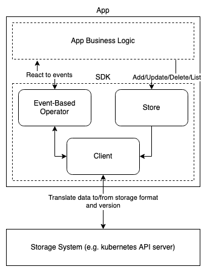
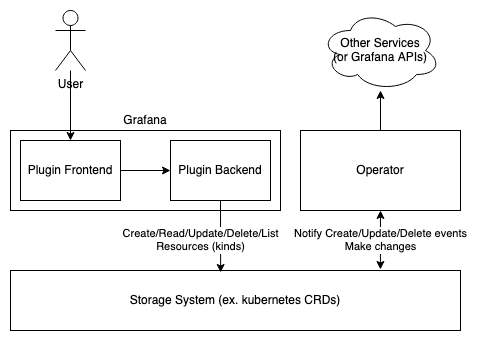

# grafana-app-sdk

 


> [!WARNING]  
> **This repository is currently *experimental*, which means that interfaces and behavior may change as it evolves.**
> Minor version increments may result in breaking changes, see [Migrations](docs/migrations/README.md) for details.

The `grafana-app-sdk` is an SDK used for developing apps for grafana app platform. It consists of a CLI for generating code and projects, and a set of libraries used to make building apps easier.

## Quickstart

If you want to try out using the SDK, there is a [tutorial to build a simple issue tracker](docs/tutorials/issue-tracker/README.md) which starts you from zero and brings you through to deploying a simple app built using the SDK.

## Documentation

Please see the [docs directory](docs/README.md) for documentation on concepts and design patterns. For go API documentation, see [godocs on pkg.go.dev](https://pkg.go.dev/github.com/grafana/grafana-app-sdk#section-directories).

## Installation of the CLI

### go install

The simplest way to install the CLI is with `go install`.

To get the latest version, use:
```bash
go install github.com/grafana/grafana-app-sdk/cmd/grafana-app-sdk@latest
```
(ensure that your `GOPATH/bin` (typically `$HOME/go/bin`) is in your `PATH`)

### Binary
If you prefer to download a binary and add it to your `PATH`, you can install a binary from the releases page:

1. [Visit the latest release page](https://github.com/grafana/grafana-app-sdk/releases/latest)
2. Find the appropriate artifact for your OS and architecture
3. Download the artifact and untar it into your PATH

Once you have a version of the CLI installed, you can test it with:
```
grafana-app-sdk version
```
Which will print the version of the CLI which you have installed.

## App Design

An agnostic view of an app using the SDK looks like:



The SDK handles interaction with the storage system, and surfacing simple interfaces for performing normal operations on resources in storage, as well as creating controller/operator loops that react to changes in the resources in the storage system.

A typical grafana app deployment might look more like:



For more details on application design, see [application design documentation](docs/application-design/README.md).

## CLI Usage

Full CLI usage is covered in [CLI docs page](docs/cli.md), but for a brief overview of the commands:

| Command | Description                                                                                                           |
|---------|-----------------------------------------------------------------------------------------------------------------------|
| `version` | Prints the version (use `-v` for a verbose print)                                                                     |
| `generate` | Generates code from your CUE kinds (defaults to CUE in `kinds`, use `-s`/`--source` to speficy a different CUE path)  |
| `project init <module name>` | Creates a project template, including directory structure, go module, CUE module, and Makefile                        |
| `project kind add <kind name>` | Add a boilerplate kind in CUE with descriptive comments for all fields                                                |
| `project component add <component>` | Add boilerplate code for a component to your project. `<component>` options are `frontend`, `backend`, and `operator` |
| `project local init` | Initialize the `./local` directory for a local development environment (done automatically by `project init`)         |
| `project local generate` | Generate a YAML bundle for local deployment, based on your CUE kinds and `./local/config.yaml`                        |

## Examples

The [examples](./examples) directory contains small examples of different grafana-app-sdk functionality. For a complete example app, you can follow the [tutorial project](docs/tutorials/issue-tracker/README.md) to build a functioning simple app with no prior knowledge necessary.

## Further Reading

Please see the [/docs](docs/README.md) directory for full documentation,
or take a look at the [Design Patterns](docs/application-design/README.md), [Kubernetes Concepts](docs/kubernetes.md), or the [tutorial](docs/tutorials/issue-tracker/README.md).

The `examples` directory contains runnable example projects that use different SDK components.

Each package also contains a README.md detailing package usage and simple examples.

## Contributing

See our [contributing guide](CONTRIBUTING.md) for instructions on how to contribute to the development of the SDK.
