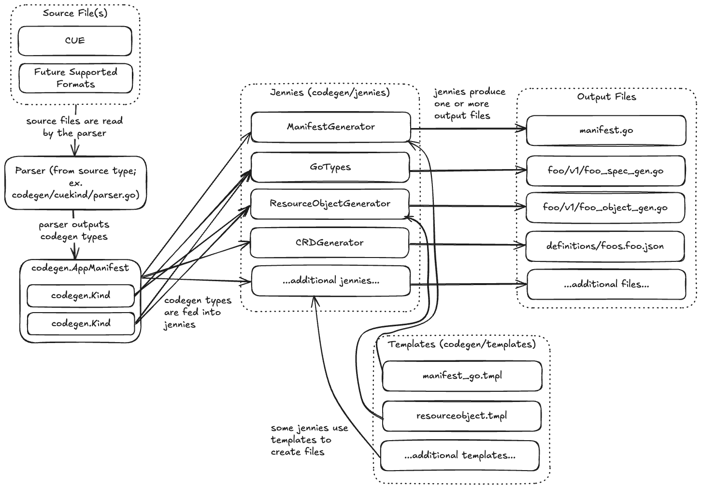

# codegen

The `codegen` package (and its child packages) is responsible for all app-sdk code generation.

<picture>
  <source media="(prefers-color-scheme: dark)" srcset="../docs/diagrams/codegen_dark.png">
  <source media="(prefers-color-scheme: light)" srcset="../docs/diagrams/codegen_light.png">
  
</picture>

To add new codegen functionality, you will need to add a jenny in `codegen/jennies`, and then add that jenny to a generator function for each source type (right now, only [cuekind/generators.go](cuekind/generators.go)).
If you create a new generator function, you will want to add usage of that function in the CLI in the `cmd/grafana-app-sdk` package.

To add a new available source type, create a package for that type and have it provide a `Parser` for `Kind` and `AppManifest`, as well as functions to return `JennyList` items for usage with the `Generator` type.
You can reference the `cuekind` package as an example.