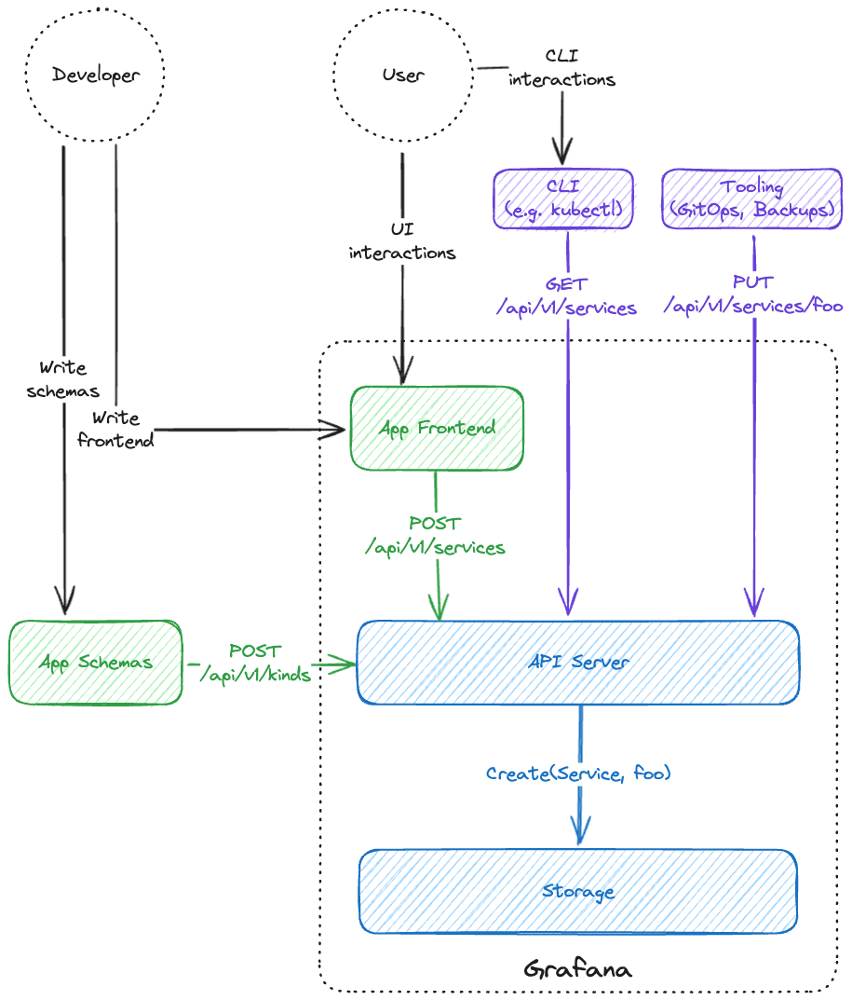
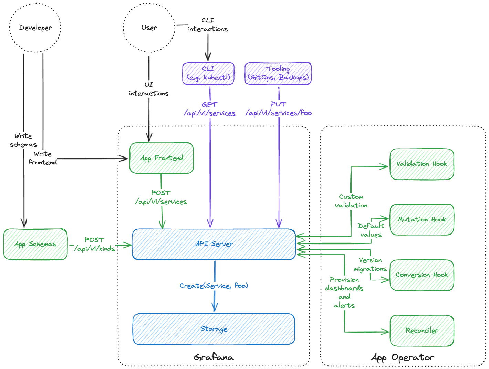
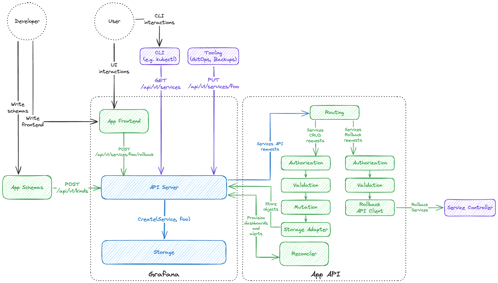

# Application design patterns

- [Overview](#overview)
- [Frontend-only applications](#frontend-only-applications)
- [Operator-based applications](#operator-based-applications)
- [Applications with custom APIs](#applications-with-custom-apis)

## Overview

While there are different ways to structure your application, the SDK and the platform have been developed based on some high-level concepts, which you can read about in [App Platform Concepts](./platform-concepts.md). It is a good idea to be aware of those, since they ultimately affect how you structure your code and data.

Depending on the required features, apps written with the SDK on top of the App Platform fall into one of the following broad categories – [frontend-only](#frontend-only-applications), [operator-based](#operator-based-applications) and [applications with custom APIs](#applications-with-custom-apis).

It's worth mentioning that there is no "lock-in" - a frontend-only app can easily evolve into having an operator on the backend and later to having some custom APIs. It is therefore a good idea to start from the minimum requirements and progress by adding pieces, as necessary, rather than trying to "future-proof" the design.

## Frontend-only applications

This is the simplest version of an application, where you don't need any backend at all. Your application can extend the API with your own Kinds and you use those in your frontend code. You can specify some basic validation rules when writing the schemas for your Kinds.

An example of such application could be a service catalogue, which lets users create services and link them to dashboards and alert rules.



In this example, your application would consist of your Grafana plugin frontend code and your Kind schemas, which are provisioned to the API server, so that it can let you store your custom objects in the storage.

Once the schemas are provided, you can provide end users with a way to interact with the objects via the UI in your frontend. Users also get the ability to manage their data via CLI tools like `kubectl` or machine-to-machine tooling like `Flux` for gitops or `Velero` for automatic backups. This functionality is supported by the platform itself – you don't need to write custom code for it.

**It is important to keep in mind** the fact that your UI is not the only way for the user to manage your application's data, which means that you should write your code accordingly, with the expectation that some objects may have been added or edited directly via the API, rather than through the code paths in your frontend.

## Operator-based applications

Unlike frontend-only applications, operator-based applications have a backend component, called the operator. This component may contain code for custom validation logic, mutating objects before they are written to the API and performing data migration between different versions of your Kind schemas.

Using the same service catalogue example from the previous section, you can add an operator that woud do some or all of the following:

* **Validation**. You can have custom validation logic for your service objects.
* **Mutation**. You can attach extra default values for each newly created service.
* **Conversion**. You can handle data migration from `/api/v1/services` to `/api/v2/services`.
* **Reconciliation**. Rather than requiring users to create and link dashboards and alerts separately, your operator can provision those automatically for each newly created service.



In this example, your operator implements all of the features mentioned above. Keep in mind, that the operator could be deployed as a single binary (or even as a Grafana plugin) for convenience. Obviously, if you need to ensure better scalability or reliability, you can choose to deploy each operator component as a separate process / service.

**It is important to keep in mind** that all types of hooks are called by the API server before the object is stored, so they should not block the request processing for a long period of time. In fact, the API server will simply fail the request if your hook is not responding or taking too long to respond.

Your logic (e.g. provisioning dashboards and alerts) should normally be part of the asynchronous reconciler.

## Applications with custom APIs

While previous two options work for a lot of applications, there are of course some apps which may require custom API endpoints for one reason or another. To support those, you can ship your backend as an "extension" API server, rather than an operator.

In practice this means that rather than routing API requests through the API server's internal logic and directly the storage (and your app's hooks, if present), the API server would instead proxy them to your app's backend. The API server would still take care of authenticating the request and taking care of rate-limiting and similar request handling tasks, but otherwise your app has full control over how the request is processed, including things like:

* **Authorization**. You are free to authorize the request yourself, although by default you can delegate it back to the API server.
* **Validation and mutation**. Same as with hooks, you can perform custom validation rules and set default values or modify data in-flight.
* **Data migration**. Same as with a conversion hook, you can convert your data between schema versions.
* **Storage**. Unlike two previous options, here you have to handle the storage yourself. This is helpful, when you already need custom storage, e.g. you're handling data that doesn't work well within the limitations of the provided storage or you don't need storage at all (maybe your data is read-only system metrics). If you want to add only a few custom API endpoints and still use the platform-provided storage, you can achieve that by using different names for the APIs you expose to the user vs. the ones that you use to store your data.

Continuing with our examples from previous sections, let's say that we want to extend our application with a custom route that would let users rollback services to older versions, e.g. as an action to a service failing and firing an alert.



In this example, your application takes full control over handling the `/api/v1/services`, splitting the logic between regular CRUD actions (which were previously handled by the API server) and the custom API endpoint for service rollback. Keep in mind that despite this diagram has different authorization and validation for different requests, they may as well be the same, depending on the app. This example also stores services back to the API server, like previous ones but other apps may choose different storage options.

**It is important to keep in mind** that your custom API endpoints still have to follow the API server standards, i.e. they need to be RESTful and follow the resource-subresource patterns. In the example above, the rollback endpoint can be implemented via a subresource, e.g.:
```bash
curl -XPOST /apis/services.grafana.app/v1/namespaces/default/services/my-service/rollback \
-H 'Content-Type: application/json' \
-d @- <<'EOF'
{
  "apiVersion": "services.grafana.app/v1",
  "kind": "ServiceRollbackRequest",
  "metadata": {
    "name": "my-service",
    "namespace": "default",
    "uid": "70344320-fa82-48b2-9161-443e6939f74d",
    "resourceVersion": "1892768507",
    "creationTimestamp": "2023-09-27T18:28:52Z"
  },
  "spec": {
    "rollbackVersion": "abc123"
  }
}
EOF
```

In other words you would be defining a pseudo-subresource with the name `ServiceRollbackRequest` and using it to supply all information required for a service version rollback.
