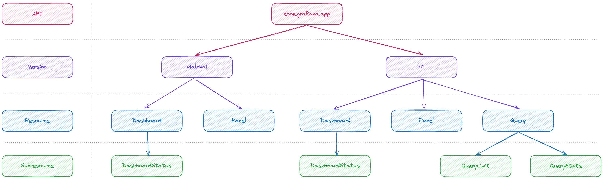
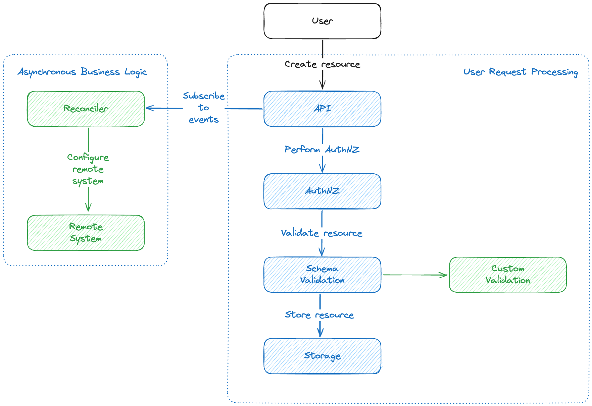
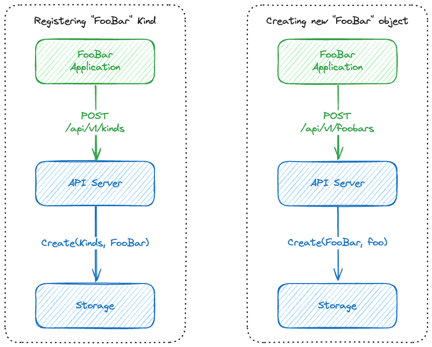

# App Platform Concepts

- [Overview](#overview)
- [Standardized RESTful APIs](#standardized-restful-apis)
- [Asynchronous business logic](#asynchronous-business-logic)
- [Document-oriented unified storage](#document-oriented-unified-storage)

## Overview

On the high level, the App Platform consists of three major pieces – the SDK, the API server and the Storage.

App platform has also been designed around a few important high-level concepts, namely:

1. Standardized RESTful APIs
2. Asynchronous business logic
3. Document-oriented unified storage

It's a good idea to understand those concepts, since they influence the design of applications built on top of the platform and the SDK.

## Standardized RESTful APIs

App Platform & App SDK follow the concept of resource-focused, grouped and versioned APIs.  This means that all APIs (including the system ones) have to follow the hierarchy of `/<api-group>/<api-version>/<resource>/<subresource>`. The resources can also be namespaced, i.e. separated between multiple different namespaces or tenants. Namespacing allows e.g. creating resources with the same names for different tenants, as well as isolating the resources of one tenant from the resources of all other tenants.

Here's a diagram for a theoretical API group for dashboards, panels and queries:

If we follow this diagram, we can make the following requests to the API:

* `GET /core.grafana.app/v1alpha1/panels` lists all `Panel` resources of the `v1alpha1` version in the `core.grafana.app` API group.
* `GET /core.grafana.app/v1/namespaces/default/queries/foo/querylimit` will retrieve the `QueryLimit` subresource of the `foo` `Query` resource of the `v1` version in the `core.grafana.app` API group, in the `default` namespace.

Standardizing the API makes it easy to extend it, build tools that integrate with it, generate client code and so on. However, it also requires developers to adhere to it and design their applications keeping in mind some of the API limitations.

Most important limitations are:

* All routes have to be resource-oriented. Think about how you structure your application's logic around resources & subresources. For example, if you want to have a resource with some usage stats, you cannot have an RPC-like API for it, you have to create a dedicated `FooStats` subresource (assuming your resource is called `Foo`), which would contain a stats object.
* Clients can always call any of the supported API versions, but only one version is considered "primary". When rolling out a new API version, you may need to think how you'd migrate existing data.
* Namespacing allows for isolating tenants but also means that if you want to move a resource from one tenant to another, you have to create it in the new namespace and delete it in the old one, there is no "move" operation.
* Similarly to the previous point, there is no "rename" operation. Changing an object's `metadata.name` is not possible after the object has been created, so if you need to rename objects, you have to perform the same "create a copy with a new name and delete the old object" series of operations. A common pattern for app developers is to treat `metadata.name` as an identifier instead (which it is) and use another field for user-facing, editable name. That way users can still rename the objects, without having to "create new and delete old" every time they do that.

## Asynchronous business logic

Unlike conventional approach to API building, the app platform & SDK approach relies on asynchronous processing called "reconciliation".

In practice, it means that instead of executing your logic when a user submits a request to the API, before the data is stored in the database, the system instead splits the user request and the logic processing into two separate and independent loops. In other words, the only thing that happens when a user is submitting a request to the API (i.e. creates or updates a resource), the API only performs authNZ and validation, before storing the data in the database and returning the response to the user.

Your logic is then invoked asynchronously, in response to an event (i.e. "resource has been created" or "resource has been updated"). This way, your code has much more relaxed requirements, like not being limited by how much time it can take or allowing you to easily retry failed operations and so on. On the other hand, you need to approach giving user feedback in a different way, especially about persistent errors. Whereas with more common synchronous approach you could reject a request that cannot be fulfilled, with the asynchronous approach you need to dedicate separate error or status fields for communicating unprocessable errors to the user and rely on the user to monitor them.

However, the platform and the SDK do allow you to define custom validation logic, for those cases where simple validation schema does not suffice, but it must only be used for validation and is not allowed to have side effects.

In the example diagram above, the application has custom validation logic, which is executed in the request processing loop and the reconciler that takes care of configuring some remote system in an asynchronous loop, in response to resources being created (e.g. users could be submitting Prometheus scrape rules and the reconciler could be applying them to some Prometheus instance via configuration). Notice how the two loops are completely separate.

## Document-oriented unified storage

The platform uses so-called "document-oriented" storage model, which in practice means that the data is stored as key-value pairs, with value consisting of metadata (creation timestamps, tenant IDs, labels and so on) and binary payload data. For example, a dashboard might be stored with its UID as key, its folder as metadata and its JSON model as a binary blob.

The storage exposes a relatively simple (compared to e.g. SQL) API:

* `Get` - returns a single object for a given API group, version and Kind, using object's UID.
* `List` - fetches a list of objects for a given API group, version and Kind, e.g. all Dashboards. It supports pagination and some basic filtering by namespaces or object labels.
* `Watch` - works similarly to `List` but instead of returning immediately, instead opens a stream, which receives newly created objects, objects which have been updated and objects which have been deleted. In other words, it lets the client "watch" for changes of a specific Kind, hence the name.
* `Create` - creates a new object from the data in the request.
* `Update` - updates a specific object given its UID. Optionally the object's resource version could be supplied to perform optimistic locking - the update will be applied only if the version of the object in the storage is the same as the one provided in the request.
* `Delete` - deletes an existing object by its UID.

This simple design may seem limiting at first, but it enables one of the most powerful features of the platform & SDK - it can be used to store different payloads. Because of this choice, you can use it to store custom data types and although you won't be interacting with the storage directly, there is a separate API for extending the backend with your own Kinds.

In this hyphothetical example you can see that the storage (and the API) can be configured to support other Kinds, so that the application can then store and read objects of that Kind.

Some important things to keep in mind:

* The storage and the API don't support very large objects, i.e. you cannot store an object that contains 100 MB of data.
* There is no way to create or update multiple objects in bulk.
* Likewise, there are no transactions.
* All objects are versioned. This is important, because if you are watching for changes, you may see the same object multiple times and the only way to tell them apart is by looking at their versions.
* `Watch` can be used not only for reacting to changes but also for caching data on the client side, to improve performance of your application and to reduce the amount of requests to the API. In fact, this is exactly what the SDK does internally.