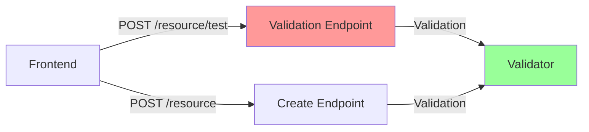
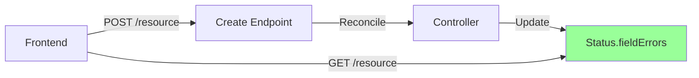

# Field Errors in Status: Actionable Runtime Validation Errors

## Overview

This document establishes the convention for reporting actionable validation and runtime errors in Kubernetes-style resource APIs. Instead of using separate custom validation endpoints (such as `/test`, `/validate`, `/check`, etc.), errors that depend on external systems, internal runtime state, or dynamic conditions should be reported in the resource's `status` field using `fieldErrors`. These errors provide actionable guidance to users, indicating what field values need to be changed (e.g., use a different branch, repository, installation ID) to resolve validation issues.

## Convention

**All resources that require validation or runtime error reporting MUST expose errors via `status.fieldErrors` rather than separate custom validation endpoints.**

### Status Structure

Resources should include a `fieldErrors` array in their status:

```go
type ResourceStatus struct {
    // ... other status fields ...
    
    // FieldErrors contains validation and runtime errors for specific fields.
    // These errors are automatically populated by controllers during reconciliation.
    FieldErrors []ErrorDetails `json:"fieldErrors,omitempty"`
}

type ErrorDetails struct {
    // Type is a machine-readable description of the cause of the error.
    // This matches Kubernetes' CauseType values (e.g., FieldValueInvalid, FieldValueRequired).
    Type metav1.CauseType `json:"type"`
    
    // Field is the JSON path to the field that caused the error.
    // Examples: "spec.github.branch", "spec.installationID", "secure.token"
    Field string `json:"field,omitempty"`
    
    // Detail provides a human-readable explanation of what went wrong.
    // This should be actionable - guide users to change the value to something valid.
    // Examples: "branch not found", "repository not found", "installation ID invalid"
    Detail string `json:"detail,omitempty"`
    
    // Origin indicates where the error originated (optional).
    // Can reference a specific validator, service, or rule.
    Origin string `json:"origin,omitempty"`
}
```

## When to Use This Pattern

**Key Principle**: `fieldErrors` in status should be used for validation errors that **depend on external systems** or **dynamic state that could change over time**. Format validation and hard rules should be handled by **admission validators**.

**Actionable Guidance**: `fieldErrors` are intended to provide **actionable guidance** to users. They should indicate what needs to be changed (e.g., use a different branch, repository, installation ID) to resolve the error. The errors guide users to update field values to valid alternatives.

### ✅ Use `fieldErrors` in Status When:

**Key Principle**: Use `fieldErrors` for validation errors that depend on **external systems, internal runtime state, or dynamic conditions** that could change over time. These are errors that cannot be determined at admission time and require runtime checks.

1. **External system validation**: Errors from external services or APIs
   - Example: GitHub API returns "installation not found", Git repository doesn't exist, external service unavailable
   - These require actual API calls to external systems that may not be available during admission
   - The external system state can change independently of your resource
   - **Key indicator**: Requires calling an external API or service
   - **User action**: Guide users to change the value (e.g., use a different installation ID, repository URL, or branch name)

2. **Internal runtime validation**: Errors that depend on internal system state or runtime conditions
   - Example: Resource conflicts detected at runtime, internal service unavailable, state-dependent validation failures
   - These require checking internal system state that may change or may not be available during admission
   - Internal state can change after resource creation
   - **Key indicator**: Requires checking internal runtime state or conditions
   - **User action**: Guide users to change the value or resolve the conflict (e.g., use a different resource name, wait for service availability)

3. **Dynamic state validation**: Errors that depend on current system state that could change
   - Example: Branch exists now but may be deleted later, connection credentials expired, resource was deleted externally
   - State can change after resource creation, making admission-time validation insufficient
   - These are "could stop existing" scenarios

4. **Runtime connectivity/authentication errors**: Errors that occur during actual operations
   - Example: Authentication failures, network connectivity issues, service unavailable
   - These cannot be detected until the controller attempts to use the resource
   - May be transient or permanent depending on external factors

5. **Resource lifecycle errors**: Errors that occur during ongoing resource operations
   - Example: Sync failures, health check failures, operational errors
   - These happen continuously during the resource lifecycle, not just at creation time

### ❌ Don't Use `fieldErrors` For:

**Key Principle**: Use admission validators for **static rules** and **format validation** that can be checked without external dependencies.

1. **Format and structure validation**: Use admission webhooks/validators instead
   - Example: Required fields missing, invalid enum values, type mismatches, malformed URLs, invalid JSON structure
   - These are hard rules that don't depend on external systems
   - Can and should be caught before the resource is created/updated
   - Examples:
     - `spec.github.branch` is required (required field)
     - `spec.type` must be one of: "github", "git", "local" (enum validation)
     - `spec.github.url` must be a valid URL format (format validation)
     - `spec.sync.intervalSeconds` must be a positive integer (type/range validation)

2. **Syntactic validation**: Use OpenAPI schema validation instead
   - Example: Invalid JSON structure, wrong data types, missing required properties
   - These are handled by the API server's schema validation before reaching admission or controllers

3. **Business rule validation**: Use admission webhooks instead
   - Example: Resource name conflicts, reserved names, naming conventions
   - These are static rules that don't require external system checks

### Decision Tree

```
Is the validation error about:
├─ Format/structure/type? → Use Admission Validator
├─ Static business rules? → Use Admission Validator  
├─ External system state? → Use fieldErrors in Status ✅
├─ Internal runtime state? → Use fieldErrors in Status ✅
├─ Dynamic state that could change? → Use fieldErrors in Status ✅
└─ Runtime connectivity/auth? → Use fieldErrors in Status ✅
```

### Examples: Admission Validator vs fieldErrors

**Admission Validator (Static Rules)**:
```go
// ❌ Wrong: Don't use fieldErrors for format validation
if !isValidURL(spec.github.url) {
    // This should be caught in admission, not status
}

// ✅ Correct: Use admission validator
func Validate(repo *Repository) field.ErrorList {
    if repo.Spec.GitHub.URL == "" {
        return field.ErrorList{
            field.Required(field.NewPath("spec", "github", "url"), "URL is required"),
        }
    }
    if !isValidURLFormat(repo.Spec.GitHub.URL) {
        return field.ErrorList{
            field.Invalid(field.NewPath("spec", "github", "url"), repo.Spec.GitHub.URL, "Invalid URL format"),
        }
    }
    return nil
}
```

**fieldErrors in Status (Runtime Validation)**:
```go
// ✅ Correct: Use fieldErrors for runtime validation (external or internal)
func (c *Controller) reconcile(ctx context.Context, repo *Repository) error {
    var fieldErrors []ErrorDetails
    
    // Runtime validation checks - these require actual operations, not just spec validation
    
    // Example 1: Check if repository exists (external system check)
    exists, err := c.gitClient.RepoExists(ctx, repo.Spec.GitHub.URL)
    if err != nil {
        fieldErrors = append(fieldErrors, ErrorDetails{
            Type:   metav1.CauseTypeFieldValueInvalid,
            Field:  "spec.github.url",
            Detail: fmt.Sprintf("failed to check if repository exists: %v", err),
        })
    } else if !exists {
        fieldErrors = append(fieldErrors, ErrorDetails{
            Type:   metav1.CauseTypeFieldValueInvalid,
            Field:  "spec.github.url",
            Detail: "repository not found", // Actionable: user should check/update URL
        })
    }
    
    // Example 2: Check if branch exists (external system check)
    if exists {
        branchRef := fmt.Sprintf("refs/heads/%s", repo.Spec.GitHub.Branch)
        _, err := c.gitClient.GetRef(ctx, branchRef)
        if err != nil {
            if errors.Is(err, nanogit.ErrObjectNotFound) {
                fieldErrors = append(fieldErrors, ErrorDetails{
                    Type:   metav1.CauseTypeFieldValueInvalid,
                    Field:  "spec.github.branch",
                    Detail: "branch not found", // Actionable: user should change to a valid branch
                })
            } else {
                fieldErrors = append(fieldErrors, ErrorDetails{
                    Type:   metav1.CauseTypeFieldValueInvalid,
                    Field:  "spec.github.branch",
                    Detail: fmt.Sprintf("failed to check if branch exists: %v", err),
                })
            }
        }
    }
    
    // Example 3: Check authentication (runtime connectivity check)
    authorized, err := c.gitClient.IsAuthorized(ctx)
    if err != nil || !authorized {
        detail := "not authorized"
        if err != nil {
            detail = fmt.Sprintf("failed check if authorized: %v", err)
        }
        fieldErrors = append(fieldErrors, ErrorDetails{
            Type:   metav1.CauseTypeFieldValueInvalid,
            Field:  "secure.token",
            Detail: detail, // Actionable: user should update credentials
        })
    }
    
    // Example 4: Check for resource name conflicts (internal runtime state check)
    existing, err := c.resourceLister.Get(repo.Name)
    if err == nil && existing != nil && existing.UID != repo.UID {
        fieldErrors = append(fieldErrors, ErrorDetails{
            Type:   metav1.CauseTypeFieldValueDuplicate,
            Field:  "metadata.name",
            Detail: fmt.Sprintf("resource with name '%s' already exists", repo.Name), 
            // Actionable: user should use a different name
        })
    }
    
    // Update fieldErrors in status
    patchOps := []map[string]interface{}{
        {
            "op":    "replace",
            "path":  "/status/fieldErrors",
            "value": fieldErrors,
        },
    }
    
    return c.statusPatcher.Patch(ctx, repo, patchOps...)
}
```

### Writing Actionable Error Messages

`fieldErrors` are intended to provide **actionable guidance** to users. They should guide users to change field values to valid alternatives (e.g., use a different branch, repository, installation ID).

**Good Examples** (Actionable):
- `"branch not found"` → User knows to change the branch name to an existing branch
- `"repository not found"` → User knows to check/update the repository URL
- `"installation ID invalid"` → User knows to update the installation ID to a valid one
- `"authentication failed"` → User knows to update credentials

**Bad Examples** (Not Actionable):
- `"error occurred"` → Too vague, doesn't guide action
- `"validation failed"` → Doesn't indicate what to change
- `"invalid value"` → Doesn't specify what's invalid or how to fix it

**Best Practice**: Error messages should:
1. Clearly identify what's wrong (e.g., "branch not found")
2. Imply what field needs to be changed (via the `Field` property)
3. Guide users toward valid alternatives (e.g., "use an existing branch name")

## Examples

### Example 1: Connection Resource

**Scenario**: A GitHub connection has an invalid installation ID.

```yaml
apiVersion: provisioning.grafana.app/v0alpha1
kind: Connection
metadata:
  name: my-connection
spec:
  type: github
  github:
    appID: "123456"
    installationID: "999999999"  # Invalid installation ID
status:
  observedGeneration: 1
  state: Disconnected
  health:
    healthy: false
    checked: 1699123456
  fieldErrors:
    - type: FieldValueInvalid
      field: spec.installationID
      detail: "invalid installation ID: 999999999"
```

**Frontend Usage**:
```typescript
// After creating the connection, wait for reconciliation
const conn = await waitForReconciliation('my-connection');

// Display error next to the installationID field
conn.status.fieldErrors?.forEach(error => {
  if (error.field === 'spec.installationID') {
    setFieldError('installationID', error.detail);
  }
});
```

### Example 2: Repository Resource

**Scenario**: A repository references a non-existent branch.

```yaml
apiVersion: provisioning.grafana.app/v0alpha1
kind: Repository
metadata:
  name: my-repo
spec:
  type: github
  github:
    url: "https://github.com/grafana/grafana"
    branch: "non-existent-branch"
status:
  observedGeneration: 1
  health:
    healthy: false
    checked: 1699123456
  fieldErrors:
    - type: FieldValueInvalid
      field: spec.github.branch
      detail: "branch not found"
```

**List View Usage**:
```typescript
// In a list of repositories
repositories.map(repo => (
  <ListItem>
    <Name>{repo.name}</Name>
    {repo.status.fieldErrors?.length > 0 && (
      <Badge variant="error">
        {repo.status.fieldErrors[0].detail}  // "Branch not found"
      </Badge>
    )}
  </ListItem>
));
```

### Example 3: Multiple Field Errors

**Scenario**: A repository has multiple validation issues.

```yaml
status:
  fieldErrors:
    - type: FieldValueInvalid
      field: spec.github.url
      detail: "repository not found"  # Actionable: user should check URL or repository name
    - type: FieldValueInvalid
      field: secure.token
      detail: "not authorized"  # Actionable: user should update credentials
```

**User Actions**: Each error guides the user to fix a specific issue:
1. **Repository URL error**: User should verify the repository exists and update `spec.github.url` if incorrect
2. **Token error**: User should update `secure.token` with valid credentials

**Frontend Usage**:
```typescript
// Display all errors grouped by field
repo.status.fieldErrors?.forEach(error => {
  const fieldId = mapFieldPathToFormField(error.field);
  setFieldError(fieldId, error.detail);
});
```

## Controller Implementation

Controllers should populate `fieldErrors` during reconciliation by performing actual runtime validation checks:

```go
func (c *ResourceController) process(ctx context.Context, resource *Resource) error {
    var fieldErrors []ErrorDetails
    
    // Perform actual runtime validation checks
    // These are checks that require operations, not just spec inspection
    
    // Example: Check external system (GitHub API, Git repository, etc.)
    if resource.Spec.Type == "github" {
        // Check if installation exists
        installation, err := c.githubClient.GetInstallation(ctx, resource.Spec.InstallationID)
        if err != nil {
            fieldErrors = append(fieldErrors, ErrorDetails{
                Type:   metav1.CauseTypeFieldValueInvalid,
                Field:  "spec.installationID",
                Detail: fmt.Sprintf("installation ID %s not found", resource.Spec.InstallationID),
            })
        }
        
        // Check if repository exists
        if installation != nil {
            repoExists, err := c.githubClient.RepoExists(ctx, resource.Spec.RepositoryURL)
            if err != nil || !repoExists {
                fieldErrors = append(fieldErrors, ErrorDetails{
                    Type:   metav1.CauseTypeFieldValueInvalid,
                    Field:  "spec.repositoryURL",
                    Detail: "repository not found",
                })
            }
        }
    }
    
    // Example: Check internal runtime state (resource conflicts, etc.)
    conflicts, err := c.checkConflicts(ctx, resource)
    if err == nil && len(conflicts) > 0 {
        for _, conflict := range conflicts {
            fieldErrors = append(fieldErrors, ErrorDetails{
                Type:   metav1.CauseTypeFieldValueDuplicate,
                Field:  conflict.Field,
                Detail: conflict.Message,
            })
        }
    }
    
    // Build patch operations
    patchOps := []map[string]interface{}{
        {
            "op":    "replace",
            "path":  "/status/fieldErrors",
            "value": fieldErrors,
        },
    }
    
    // Apply status patch
    return c.statusPatcher.Patch(ctx, resource, patchOps...)
}
```

## Frontend Integration

### Create/Update Flow

1. Submit CREATE or UPDATE request
2. Wait for reconciliation (`status.observedGeneration == metadata.generation`)
3. Read `status.fieldErrors`
4. Map field paths to form fields
5. Display inline validation errors

**Using Watch (Recommended)**:
```typescript
async function waitForReconciliation(name: string): Promise<Resource> {
  return new Promise((resolve, reject) => {
    const watch = api.watchResource(name);
    
    watch.on('update', (resource) => {
      if (resource.status.observedGeneration === resource.metadata.generation) {
        watch.close();
        resolve(resource);
      }
    });
  });
}
```

**Using Poll**:
```typescript
async function waitForReconciliation(name: string): Promise<Resource> {
  while (true) {
    const resource = await api.getResource(name);
    if (resource.status.observedGeneration === resource.metadata.generation) {
      return resource;
    }
    await sleep(500);
  }
}
```

### List View

```typescript
// GET /resources returns list with status.fieldErrors
resources.forEach(resource => {
  const errors = resource.status.fieldErrors || [];
  if (errors.length > 0) {
    // Display badge with first error
    showErrorBadge(resource.name, errors[0].detail);
  }
});
```

## Using `dryRun=true` for Pre-Creation Validation

### Overview

Kubernetes provides a standard `dryRun=true` parameter for validating requests without persisting changes. This allows frontends to validate resources before creation, addressing the concern of "avoiding creation of invalid objects."

### Important: `fieldErrors` Are NOT Populated During `dryRun`

**Critical Understanding**: When using `dryRun=true`, `fieldErrors` in status are **not populated** because:

1. **Resource is not persisted**: `dryRun` skips storage writes, so the resource doesn't exist in the API server
2. **Controllers don't run**: Controllers only reconcile persisted resources, so no controller reconciliation occurs
3. **Status is empty/default**: Since no controller has run, the status field is empty or contains default values

### What Happens During `dryRun=true`

**Admission validation errors** are returned as HTTP errors (not `fieldErrors` in status):

```go
// Admission validator can perform runtime validation during dryRun
func (v *AdmissionValidator) Validate(ctx context.Context, a admission.Attributes, o admission.ObjectInterfaces) error {
    // Standard admission validation (format, structure)
    if err := v.validateStructure(a.GetObject()); err != nil {
        return err
    }
    
    // If dryRun, also run runtime validation (external systems, internal state)
    if a.IsDryRun() {
        if err := v.validateRuntime(ctx, a.GetObject()); err != nil {
            // Returns apierrors.NewInvalid() with field.ErrorList
            return err
        }
    }
    
    return nil
}

func (v *AdmissionValidator) validateRuntime(ctx context.Context, obj runtime.Object) error {
    repo := obj.(*provisioning.Repository)
    
    // Run same validation checks that controller would do
    // Check external systems
    if exists, err := v.gitClient.RepoExists(ctx, repo.Spec.GitHub.URL); err != nil || !exists {
        return apierrors.NewInvalid(
            provisioning.RepositoryGroupVersionKind.GroupKind(),
            repo.Name,
            field.ErrorList{
                field.Invalid(field.NewPath("spec", "github", "url"), repo.Spec.GitHub.URL, "repository not found"),
            },
        )
    }
    
    // Check branch exists
    branchRef := fmt.Sprintf("refs/heads/%s", repo.Spec.GitHub.Branch)
    if _, err := v.gitClient.GetRef(ctx, branchRef); err != nil {
        return apierrors.NewInvalid(
            provisioning.RepositoryGroupVersionKind.GroupKind(),
            repo.Name,
            field.ErrorList{
                field.Invalid(field.NewPath("spec", "github", "branch"), repo.Spec.GitHub.Branch, "branch not found"),
            },
        )
    }
    
    return nil
}
```

**Response format** (HTTP 422 Unprocessable Entity):
```json
{
  "kind": "Status",
  "apiVersion": "v1",
  "status": "Failure",
  "message": "Repository \"my-repo\" is invalid",
  "reason": "Invalid",
  "code": 422,
  "details": {
    "name": "my-repo",
    "group": "provisioning.grafana.app",
    "kind": "Repository",
    "causes": [
      {
        "type": "FieldValueInvalid",
        "field": "spec.github.branch",
        "message": "branch not found"
      }
    ]
  }
}
```

### Two-Phase Validation Strategy

**Phase 1: `dryRun=true` (Pre-Creation)**
- Admission webhooks run (including runtime validation if implemented)
- Errors returned as HTTP 422 with field details in `details.causes`
- Resource is **not persisted** (no storage write)
- **No `fieldErrors` in status** (resource doesn't exist, controllers don't run)

**Phase 2: After Creation (Post-Creation)**
- Resource is persisted
- Controllers reconcile and populate `status.fieldErrors`
- Errors available in `status.fieldErrors` array
- Frontend can watch/poll for status updates

### Frontend Implementation Pattern

**Pre-Creation Validation with `dryRun`**:
```typescript
// Step 1: Validate before creation using dryRun
async function validateBeforeCreate(spec: ResourceSpec): Promise<ValidationErrors> {
  try {
    await api.createResource(spec, { dryRun: true });
    return []; // No errors
  } catch (error) {
    // Extract field errors from HTTP error response
    if (error.status === 422 && error.body?.details?.causes) {
      return error.body.details.causes.map((cause: any) => ({
        field: cause.field,
        message: cause.message,
        type: cause.type,
      }));
    }
    throw error; // Re-throw unexpected errors
  }
}

// Step 2: Create resource if validation passes
async function createResource(spec: ResourceSpec) {
  // Validate first
  const errors = await validateBeforeCreate(spec);
  if (errors.length > 0) {
    // Display errors in form without creating resource
    errors.forEach(error => {
      setFieldError(mapFieldPathToFormField(error.field), error.message);
    });
    return;
  }
  
  // Create resource
  const resource = await api.createResource(spec);
  
  // Step 3: Wait for reconciliation and check status.fieldErrors
  const reconciled = await waitForReconciliation(resource.metadata.name);
  
  // Check for any runtime errors that occurred during reconciliation
  if (reconciled.status.fieldErrors?.length > 0) {
    reconciled.status.fieldErrors.forEach(error => {
      setFieldError(mapFieldPathToFormField(error.field), error.detail);
    });
  }
}
```

**Why Both Phases?**

1. **`dryRun` (Phase 1)**: Prevents creating invalid resources, provides immediate feedback
2. **Status `fieldErrors` (Phase 2)**: Handles errors that occur after creation (e.g., external system changes, transient failures, ongoing validation)

### Admission Webhook Implementation

To enable runtime validation during `dryRun`, implement validation in your admission webhook:

```go
func (v *AdmissionValidator) Validate(ctx context.Context, a admission.Attributes, o admission.ObjectInterfaces) error {
    obj := a.GetObject()
    if obj == nil {
        return nil
    }
    
    repo := obj.(*provisioning.Repository)
    
    // Standard admission validation (format, structure, static rules)
    if err := v.validateStructure(repo); err != nil {
        return err
    }
    
    // If dryRun, also run runtime validation (external systems, internal state)
    // This allows full validation without persisting the resource
    if a.IsDryRun() {
        if err := v.validateRuntime(ctx, repo); err != nil {
            return err // Return errors immediately - resource won't be created
        }
    }
    
    return nil
}

func (v *AdmissionValidator) validateRuntime(ctx context.Context, repo *provisioning.Repository) error {
    var list field.ErrorList
    
    // Run same validation checks that controller would do
    // Check external systems
    exists, err := v.gitClient.RepoExists(ctx, repo.Spec.GitHub.URL)
    if err != nil {
        list = append(list, field.Invalid(
            field.NewPath("spec", "github", "url"),
            repo.Spec.GitHub.URL,
            fmt.Sprintf("failed to check if repository exists: %v", err),
        ))
    } else if !exists {
        list = append(list, field.Invalid(
            field.NewPath("spec", "github", "url"),
            repo.Spec.GitHub.URL,
            "repository not found",
        ))
    }
    
    // Check branch exists
    if exists {
        branchRef := fmt.Sprintf("refs/heads/%s", repo.Spec.GitHub.Branch)
        _, err := v.gitClient.GetRef(ctx, branchRef)
        if err != nil {
            if errors.Is(err, nanogit.ErrObjectNotFound) {
                list = append(list, field.Invalid(
                    field.NewPath("spec", "github", "branch"),
                    repo.Spec.GitHub.Branch,
                    "branch not found",
                ))
            } else {
                list = append(list, field.Invalid(
                    field.NewPath("spec", "github", "branch"),
                    repo.Spec.GitHub.Branch,
                    fmt.Sprintf("failed to check if branch exists: %v", err),
                ))
            }
        }
    }
    
    if len(list) > 0 {
        return apierrors.NewInvalid(
            provisioning.RepositoryGroupVersionKind.GroupKind(),
            repo.Name,
            list,
        )
    }
    
    return nil
}
```

### Key Takeaways

1. **`dryRun=true` prevents creation**: Resource is not persisted, so invalid objects are never created
2. **Admission errors during `dryRun`**: Returned as HTTP 422 with field details in `details.causes`
3. **`fieldErrors` are NOT in status during `dryRun`**: Controllers don't run, so status is empty
4. **Two-phase validation**: Use `dryRun` for pre-creation validation, `status.fieldErrors` for post-creation validation
5. **Frontend extracts errors from HTTP response**: During `dryRun`, errors come from the HTTP error response, not from `status.fieldErrors`

### Comparison: `dryRun` vs `status.fieldErrors`

| Aspect                 | `dryRun=true`                  | `status.fieldErrors`           |
| ---------------------- | ------------------------------ | ------------------------------ |
| **When**               | Before resource creation       | After resource creation        |
| **Resource persisted** | ❌ No                           | ✅ Yes                          |
| **Controllers run**    | ❌ No                           | ✅ Yes                          |
| **Error format**       | HTTP 422 with `details.causes` | `status.fieldErrors` array     |
| **Use case**           | Pre-creation validation        | Post-creation validation       |
| **Prevents creation**  | ✅ Yes                          | ❌ No (resource already exists) |
| **Ongoing validation** | ❌ No                           | ✅ Yes (continuously updated)   |

## Custom Validation Endpoints Antipattern

### Why Custom Validation Endpoints Are Problematic

Creating separate endpoints for validation (such as `/test`, `/validate`, `/check`, etc.) violates several important principles:

#### 1. **Separation of Concerns**

**Problem**: Custom validation endpoints create a separate API surface that duplicates validation logic.



**Solution**: Single source of truth in status.



#### 2. **Stale Data**

**Problem**: Test results are only as fresh as the last test call.

```typescript
// ❌ Antipattern: Custom validation endpoint
const testResult = await api.post('/repositories/test', spec);
// or: const validateResult = await api.post('/repositories/validate', spec);
// testResult.errors may be stale if resource state changed

// ✅ Correct: Status always current
const repo = await api.get('/repositories/my-repo');
// repo.status.fieldErrors always reflects current state
```

#### 3. **List Operations Don't Work**

**Problem**: Can't see validation errors when listing resources.

```typescript
// ❌ Antipattern: Must call validation endpoint for each resource
const repos = await api.get('/repositories');
for (const repo of repos) {
  const testResult = await api.post(`/repositories/${repo.name}/test`, repo.spec);
  // or: const validateResult = await api.post(`/repositories/${repo.name}/validate`, repo.spec);
  // Multiple API calls, inefficient
}

// ✅ Correct: Errors included in list response
const repos = await api.get('/repositories');
repos.forEach(repo => {
  // repo.status.fieldErrors already available
});
```

#### 4. **CLI Tools Complexity**

**Problem**: CLI tools must make separate validation endpoint calls, requiring knowledge of custom endpoints.

```bash
# ❌ Antipattern: Must call separate validation endpoint
kubectl apply -f repo.yaml
# Now need to manually call validation endpoint
curl -X POST https://grafana.example.com/apis/provisioning.grafana.app/v0alpha1/namespaces/default/repositories/my-repo/test \
  -H "Content-Type: application/json" \
  -d @repo.yaml
# Or use a custom CLI tool that wraps this endpoint

# ✅ Correct: Check status directly - standard kubectl pattern
kubectl apply -f repo.yaml
# Wait for reconciliation (or watch)
kubectl get repository my-repo -o jsonpath='{.status.fieldErrors}'
# Or watch for status updates
kubectl get repository my-repo -w -o jsonpath='{.status.fieldErrors}'
```

#### 5. **Inconsistent Patterns**

**Problem**: Different resources use different patterns.

```typescript
// ❌ Antipattern: Inconsistent validation endpoints
if (resourceType === 'repository') {
  await api.post('/repositories/test', spec);
} else if (resourceType === 'connection') {
  await api.post('/connections/validate', spec);  // Different endpoint name!
} else if (resourceType === 'dashboard') {
  await api.post('/dashboards/check', spec);     // Yet another name!
} else {
  // No validation endpoint? Check status?
}

// ✅ Correct: Unified pattern
const resource = await api.get(`/${resourceType}/${name}`);
const errors = resource.status.fieldErrors || [];
```

#### 6. **Not Discoverable**

**Problem**: Custom validation endpoints are separate subresources that must be discovered. Different resources may use different endpoint names (`/test`, `/validate`, `/check`, etc.), making them hard to find.

```typescript
// ❌ Antipattern: Must know about validation endpoint
// Is it /test? /validate? /check? Not obvious from OpenAPI spec
// Different resources may use different names

// ✅ Correct: Errors are part of standard status
// Always available, always discoverable, consistent naming
```

### Migration from Custom Validation Endpoints

If you have existing custom validation endpoints (e.g., `/test`, `/validate`, `/check`):

1. **Add `fieldErrors` to status**: Implement controller logic to populate `fieldErrors`
2. **Mark endpoint as deprecated**: Update OpenAPI spec with deprecation notice
3. **Update documentation**: Point users to `status.fieldErrors`
4. **Frontend migration**: Update frontend to use status instead of validation endpoint
5. **Remove endpoint**: After migration period, remove the validation endpoint

## Benefits Summary

| Aspect                   | Custom Validation Endpoints                   | `fieldErrors` in Status     |
| ------------------------ | --------------------------------------------- | --------------------------- |
| **List operations**      | ❌ Requires separate calls                     | ✅ Included automatically    |
| **Real-time updates**    | ❌ Only when called                            | ✅ Continuously updated      |
| **CLI tools**            | ❌ Complex, separate calls                     | ✅ Standard kubectl patterns |
| **Frontend**             | ⚠️ Works but awkward                           | ✅ Natural integration       |
| **Discoverability**      | ❌ Separate endpoint, inconsistent naming      | ✅ Part of standard status   |
| **Consistency**          | ❌ Resource-specific, different endpoint names | ✅ Unified pattern           |
| **Kubernetes alignment** | ❌ Custom pattern                              | ✅ Follows conventions       |

## Checklist for New Resources

When creating a new resource that needs validation:

### Admission Validation (Static Rules)
- [ ] Implement admission validator for format/structure/type validation
- [ ] Validate required fields, enums, and data types in admission
- [ ] Use OpenAPI schema for syntactic validation
- [ ] Return admission errors before resource is created/updated

### Status fieldErrors (External/Dynamic)
- [ ] Add `fieldErrors []ErrorDetails` to resource status
- [ ] Implement controller logic to populate `fieldErrors` during reconciliation
- [ ] **Only use `fieldErrors` for external system or dynamic state validation**
- [ ] **Do NOT use `fieldErrors` for format validation or static rules** (use admission instead)
- [ ] Map validation errors to field paths (e.g., `spec.github.branch`)
- [ ] Include `Type`, `Field`, and `Detail` in all errors
- [ ] Add integration tests verifying `fieldErrors` are populated
- [ ] Document field path mappings for frontend
- [ ] **Do NOT** create custom validation endpoints (e.g., `/test`, `/validate`, `/check`)

## References

- [Kubernetes API Conventions - Status](https://github.com/kubernetes/community/blob/master/contributors/devel/sig-architecture/api-conventions.md#spec-and-status)
- [Kubernetes API Conventions - Resources](https://github.com/kubernetes/community/blob/master/contributors/devel/sig-architecture/api-conventions.md#resources)
- Related PR: [Add fieldErrors to Connection and Repository status](https://github.com/grafana/grafana/pull/116662)
