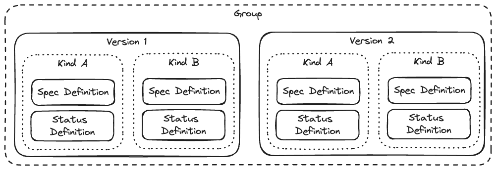

# Kinds

## What is a Kind?

A Kind is a concept [borrowed from Kubernetes](https://kubernetes.io/docs/concepts/overview/working-with-objects/), and is used to describe a type of object which can be instantiated. Think of it as a blueprint, or, in Object-Oriented Programming, a class. A Kind is a specification of the structure of an object, and instances (or objects, in OOP parlance) are called "Objects" or "Resources" (these are often used interchangably).

A Kind is composed of several components:
* A unique name (also, slightly confusingly, called Kind)
* A Group it belongs to
* A Version, and a schema for the `spec` and any subresources for that version

(a `spec` is essentially the body of the resource: for a resource like a grafana dashboard, it would be the panels. Subresources are additional payloads that are not considered part of the main body of the resource, but may be used by applications for their purposes. They are returned alongside the `spec` in reads, but must be updated via a separate call, and can have different RBAC associated with them. In kubernetes, `status` is considered a subresource).

You may have multiple versions of a kind, and they should share the same name and other metadata attributes, and each version should be convertable to each other version.

In a kubernetes-compatible API server, a kind is identified by the top-level attributes `kind` and `apiVersion` (where the `apiVersion` consists of the `group` and `version`--the group is used to identify the kind, and the version the specific schema). A kind is sometimes referenced as the Group and Kind combination (called GroupKind), or as the totality of Group, Kind, and Version (called GroupVersionKind, or GVK), which is the way to uniquely identify the schema of a resource.

Kinds are the core of apps, as they are the data structure for all app data. Apps interact with an API server to read, write, update, delete, list and watch kinds. For more on this, see [Operators and Event-Based Design](../operators.md).

Kinds belong to groups, which generally correlate to apps. In kubernetes, your kind's identifier when quering the API is `<group>/<version>/<plural>`, with `group` being the kind's full group (excepting very specific circumstances, this is your app name + `.ext.grafana.com`), `version` being the version you wish to use, and `plural` being the plural name of the kind (unless changed, this defaults to `LOWER(<kind>) + 's')`).

<picture>
  <source media="(prefers-color-scheme: dark)" srcset="../diagrams/kind-overview-dark.png">
  <source media="(prefers-color-scheme: light)" srcset="../diagrams/kind-overview.png">
  
</picture>

## Writing Kinds

In a typical app, kinds are created in the API server as a Custom Resource Definition, and in-code as instances of `resource.Kind` (containing implementations of `resource.Codec` and `resource.Object`). An app author can write out a kind in CUE and use the `grafana-app-sdk` CLI to turn that CUE into a Custom Resource Definition JSON (or YAML) file for applying to an API server, go code to use in their operator, and TypeScript code to use in their front-end. The document [Writing Kinds](./writing-kinds.md) discusses how to write kinds in CUE to use with the `grafana-app-sdk` CLI.

Alternatively, an author can write a Custom Resource Definition (CRD) themselves, and write the go and TypeScript types needed to work with the SDK and API server on their own, implementing the relevant interfaces, but this method incurs much more toil and does not guarantee that all three representations of the kind are kept synchronized.

## Kinds in-code

In-code, kinds are used via `resource.Kind` and `resource.Object`, where `resource.Kind` contains kind metadata and the ability to marshal/unmarshal the kind into a `resource.Object`, and `resource.Object` is an interface which concrete types must implement.

To learn more about how to use kinds in your app, check out [Using Kinds](./using-kinds.md).

## Kind Versions

An important part of kinds is that once a version is published, it creates an API contract so a user can request and interface with the kind schema for a specific version, rather than the schema changing as the app evolves (which would then require pinning a specific version of the app if a user wanted to use an older version of the API). If and when you need to update the schema of a kind, you add a new version to the kind (you can also have "mutable" versions, such as `v1alpha1`, in addition to immutable ones like `v1`). For best practices with kind versioning and how to support multiple kind versions in your app, see [Managing Multiple Kind Version](./managing-multiple-versions.md).