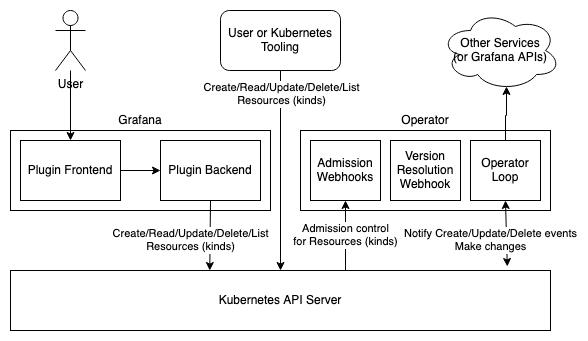
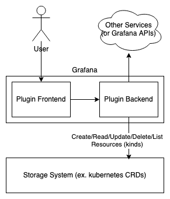
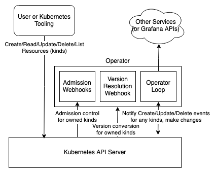

# Design Patterns

Apps written with the SDK can fall into a few different design patterns:
* Full app (front-end, back-end, operator), single-tenant or multi-tenant
* Single-tenant plugin (front-end, back-end)
* Operator only, single-tenant or multi-tenant

## Full App

This pattern is the most common and the most "designed-for" use case of the SDK. 

In this pattern, the app has a plugin which has both a front-end and back-end component to it, and an operator which handles changes to data in the store. 
The user interacts with the front-end of the plugin, which reads/writes data to back-end plugin APIs (a user could also directly interact with said APIs). 
A standalone operator then monitors for changes to resources and takes appropriate action based on the change.

Note that this pattern can work in either a single-tenant or multi-tenant context, as each tenant's plugin can be given a single namespace for the resources, 
and the operator can watch for changes across _all_ namespaces.

A kubernetes-based implementation of this pattern may also look something like this:

In this scenario, the backend plugin's APIs are no longer the sole interface to the storage layer, as we now allow direct access to kubernetes, 
where the resources are stored. To make sure invalid data cannot be put into the storage, we now add webhooks to the operator for admission control, 
which both allows for the app creator to specify data rules, and also for the SDK to ensure metadata is encoded properly within kubernetes annotations, 
and that non-user-editable metadata fields cannot be changed.

Currently, the kubernetes-based implementation is the only natively-supported implementation by the SDK, 
but since the interactions which storage are all based on interfaces, the generic design pattern can be used for any storage layer 
so long as the implementer writes a `resource.Client` implementation.

## Single-tenant Plugin

This design pattern does not use a standalone operator, and encapsulates everything into a single plugin with a front-end and back-end. 

This pattern is single-tenant as a plugin is inherently single-tenant. This pattern should be used when there is no access to the underlying store, _or_ 
if there is access, the store itself is single-tenant, or has the ability to be multi-tenant with its admission control webhooks. 
This is because the path(s) to the store for write must ensure proper data validation and encoding, which is done automatically by the SDK, 
but not automatically by the storage itself, so it must reach out to the plugin back-end for admission control if it can be accessed directly. 
Generally, it is iadvisible to use this pattern in a context where the storage layer can be accessed directly by a user, but it is doable given the stated restrictions.

An operator logical pattern _can_ be embedded in the plugin backend, but likely should only be done if the storage layer can be directly accessed. 
An embedded operator also has the caveat that if it must be initialized with data stored in the secure JSON data for the plugin, 
this cannot happen until a request is made to a backend plugin API, as the plugin only has access to the secure JSON data when it is passed along from grafana in a request.

If your storage layer is multi-tenant, it is also advisible to not embed an operator in the plugin back-end, as each single-tenant deployment of the plugin will increase the watch burden on your storage API server (unless you have a custom solution which does not suffer with this kind of scaling).

## Operator Only

This pattern is used for an application which either expects resources to only be created through other tooling (such as with direct access to a kubernetes API server), 
or depends on another app or extention's kinds existing in the storage, and taking action by watching for changes to them.

(note that this diagram uses kubernetes as an example API server to show webhook actions necessary for an operator-only pattern).

