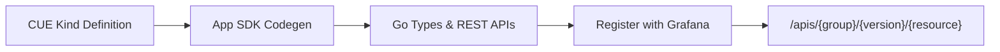
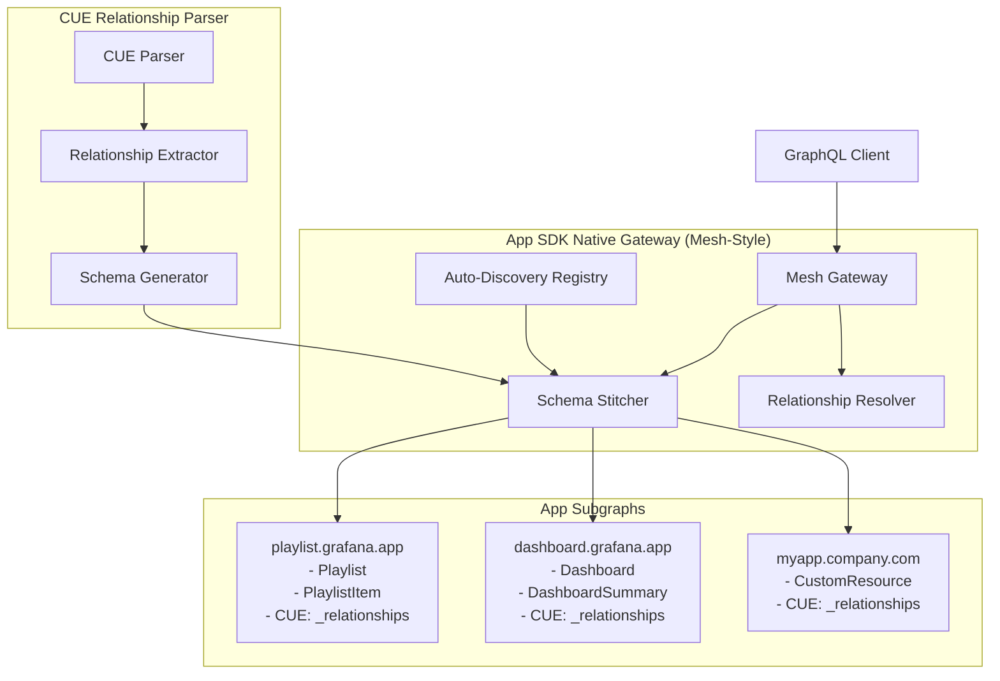

# GraphQL Mesh-Style Architecture for Grafana App Platform

## Overview

This document outlines the design for a Mesh-style GraphQL API architecture that leverages the Grafana App Platform's existing patterns. Instead of a centralized GraphQL service, each App Platform app contributes its own GraphQL subgraph, which are then composed into a unified API using native Go Mesh-style patterns that preserve CUE-based development workflows.

## Background: App Platform & CUE Concepts

### What is the App Platform?

The Grafana App Platform allows developers to create applications that extend Grafana with custom resource types (called "kinds"). These apps follow Kubernetes-style APIs and can be deployed alongside Grafana core.

### CUE (Configure, Unify, Execute)

CUE is a data validation and configuration language used in the App Platform to define resource schemas:

```cue
// Example: Playlist kind definition
#PlaylistKind: {
    kind: "Playlist"
    apiVersion: "playlist.grafana.app/v0alpha1"

    spec: #PlaylistSpec
}

#PlaylistSpec: {
    title: string
    description?: string
    items: [...#PlaylistItem]
    interval: string | *"5m"
}

#PlaylistItem: {
    type: "dashboard_by_uid" | "dashboard_by_tag"
    value: string
    title?: string
}
```

**Key CUE Concepts:**

- **Schemas**: Define the structure and validation rules for data
- **Types**: Reusable schema definitions (prefixed with `#`)
- **Constraints**: Built-in validation (required fields, types, defaults)
- **Composition**: Schemas can embed and extend other schemas

### Current App Platform Flow



## GraphQL Subgraph Composition Architecture

### Core Concept

Instead of one centralized GraphQL service, each app provides its own GraphQL subgraph. The App SDK's native gateway composes these subgraphs into a unified API using Mesh-style patterns: schema stitching, relationship configuration, and gateway-level transforms - all implemented in native Go without external dependencies.



### Architecture Principles

**Native Go Implementation**: Built directly into the App SDK without external dependencies, ensuring consistency with App Platform patterns and avoiding operational complexity.

**Runtime Composition**: Schemas are composed at startup and can be refreshed as apps are registered/unregistered, providing flexibility without the overhead of request-time composition.

**Storage Delegation**: GraphQL resolvers delegate to existing REST storage implementations, eliminating the need for data migration while reusing battle-tested storage logic.

### Schema Generation Strategy

#### Automatic Generation from CUE

The App SDK will automatically generate GraphQL schemas from existing CUE kind definitions:

**CUE Definition:**

```cue
#PlaylistKind: {
    kind: "Playlist"
    spec: {
        title: string
        description?: string
        items: [...#PlaylistItem]
    }
}
```

**Generated GraphQL Schema:**

```graphql
type Playlist {
  apiVersion: String!
  kind: String!
  metadata: ObjectMeta!
  spec: PlaylistSpec!
}

type PlaylistSpec {
  title: String!
  description: String
  items: [PlaylistItem!]!
}

type Query {
  playlist(namespace: String!, name: String!): Playlist
  playlists(namespace: String!): [Playlist!]!
}

type Mutation {
  createPlaylist(namespace: String!, input: PlaylistInput!): Playlist
  updatePlaylist(
    namespace: String!
    name: String!
    input: PlaylistInput!
  ): Playlist
  deletePlaylist(namespace: String!, name: String!): Boolean
}
```

#### Standard Patterns

Every CUE kind automatically gets:

1. **Object Types**: Generated from CUE spec structures
2. **Query Operations**:
   - `get{Kind}(namespace, name)` - Retrieve single resource
   - `list{Kind}s(namespace)` - List resources in namespace
3. **Mutation Operations**:
   - `create{Kind}(namespace, input)` - Create new resource
   - `update{Kind}(namespace, name, input)` - Update existing resource
   - `delete{Kind}(namespace, name)` - Delete resource
4. **Standard Fields**: All resources include `apiVersion`, `kind`, `metadata`

#### Type Mapping Rules

| CUE Type        | GraphQL Type       | Notes           |
| --------------- | ------------------ | --------------- |
| `string`        | `String`           |                 |
| `int`           | `Int`              |                 |
| `bool`          | `Boolean`          |                 |
| `[...T]`        | `[T]`              | Arrays          |
| `T?`            | `T` (nullable)     | Optional fields |
| `T \| *default` | `T` (with default) | Default values  |
| `#EmbeddedType` | `EmbeddedType`     | Type references |

### Relationship Handling

#### Defining Relationships in CUE

Relationships between kinds are expressed through `_relationships` metadata in CUE, following Mesh-style patterns:

```cue
#PlaylistKind: {
    kind: "Playlist"
    apiVersion: "playlist.grafana.app/v0alpha1"
    spec: #PlaylistSpec

    // Mesh-style relationship definitions
    _relationships: {
        "spec.items.dashboard": {
            target: {
                kind: "Dashboard"
                group: "dashboard.grafana.app"
                version: "v1alpha1"
            }
            resolver: {
                sourceField: "value"
                condition: "type == 'dashboard_by_uid'"
                targetQuery: "dashboard"
                targetArgs: {
                    namespace: "default"
                    name: "{source.value}"
                }
            }
        }
    }
}

#PlaylistItem: {
    type: "dashboard_by_uid" | "dashboard_by_tag"
    value: string
    title?: string
    // Note: dashboard field added automatically by relationship parser
}

#DashboardKind: {
    kind: "Dashboard"
    apiVersion: "dashboard.grafana.app/v1alpha1"
    spec: #DashboardSpec

    // Optional: reverse relationships
    _relationships: {
        "playlists": {
            target: {
                kind: "Playlist"
                group: "playlist.grafana.app"
                version: "v0alpha1"
            }
            resolver: {
                targetQuery: "playlists"
                targetArgs: {
                    namespace: "{source.metadata.namespace}"
                    filter: "spec.items[*].value == '{source.metadata.name}'"
                }
                cardinality: "many"
            }
        }
    }
}
```

#### Generated Relationship Resolvers

The CUE relationship parser automatically generates GraphQL schema with relationship fields:

```graphql
type PlaylistItem {
  type: String!
  value: String!
  title: String

  # Auto-generated from _relationships."spec.items.dashboard"
  dashboard: Dashboard # Only resolves when type == "dashboard_by_uid"
}

type Dashboard {
  apiVersion: String!
  kind: String!
  metadata: ObjectMeta!
  spec: DashboardSpec!

  # Auto-generated from _relationships."playlists"
  playlists: [Playlist!]! # Finds all playlists referencing this dashboard
}

type Query {
  playlist(namespace: String!, name: String!): Playlist
  # Automatically supports relationship traversal:
  # query { playlist { spec { items { dashboard { spec { title } } } } } }
}
```

## Gateway Implementation

### Architecture Components

#### 1. Mesh-Style Subgraph Interface

```go
// In App SDK graphql/subgraph package
type GraphQLSubgraph interface {
    GetSchema() *graphql.Schema
    GetGroupVersion() schema.GroupVersion
    GetKinds() []resource.Kind
    GetStorage(gvr schema.GroupVersionResource) Storage
}

// Extension interface for app providers
type GraphQLSubgraphProvider interface {
    GetGraphQLSubgraph() (GraphQLSubgraph, error)
}

// New: CUE-aware subgraph with relationship support
type CUEAwareSubgraph interface {
    GraphQLSubgraph
    GetRelationships() []RelationshipConfig
}
```

#### 2. Mesh-Style Schema Composition

```go
type MeshStyleGateway struct {
    subgraphs     map[string]CUEAwareSubgraph
    registry      *AppProviderRegistry
    schema        *graphql.Schema
    relationships []RelationshipConfig
}

func (g *MeshStyleGateway) ComposeSchema() (*graphql.Schema, error) {
    // 1. Parse CUE relationships from all subgraphs
    parser := NewCUERelationshipParser(g.getAllKinds())
    relationships, err := parser.ParseRelationships()
    if err != nil {
        return nil, err
    }

    // 2. Generate base schema from CUE kinds
    baseSchema, err := g.generateBaseSchema()
    if err != nil {
        return nil, err
    }

    // 3. Add relationship fields to schema
    schemaWithRelationships, err := g.addRelationshipFields(baseSchema, relationships)
    if err != nil {
        return nil, err
    }

    // 4. Store relationships for runtime resolution
    g.relationships = relationships

    return schemaWithRelationships, nil
}
```

#### 3. CUE Relationship Parser

```go
type CUERelationshipParser struct {
    kinds []resource.Kind
}

type RelationshipConfig struct {
    SourceType        string
    SourceField       string
    TargetType        string
    TargetService     string
    TargetQuery       string
    TargetArguments   map[string]string
    RequiredSelection []string
    Transform         func(source interface{}) map[string]interface{}
}

func (p *CUERelationshipParser) ParseRelationships() ([]RelationshipConfig, error) {
    var relationships []RelationshipConfig

    for _, kind := range p.kinds {
        // Extract _relationships metadata from CUE
        cueValue := p.getCUEValueFromKind(kind)
        relationshipsField := cueValue.LookupPath(cue.ParsePath("_relationships"))

        if !relationshipsField.Exists() {
            continue
        }

        // Parse each relationship definition
        kindRelationships, err := p.parseKindRelationships(kind, relationshipsField)
        if err != nil {
            return nil, err
        }

        relationships = append(relationships, kindRelationships...)
    }

    return relationships, nil
}
```

#### 4. Auto-Discovery Integration

The gateway integrates with App Platform's registration pattern:

```go
// Auto-discovery finds GraphQL-capable providers with CUE relationship support
registry, err := gateway.AutoDiscovery(playlistProvider, dashboardProvider)
if err != nil {
    return nil, err
}

// Get Mesh-style gateway with automatic relationship parsing
meshGateway := registry.GetMeshStyleGateway()

// Parse and configure relationships from CUE
err = meshGateway.ParseAndConfigureRelationships()
if err != nil {
    return nil, err
}

// Register GraphQL endpoint
http.HandleFunc("/graphql", meshGateway.HandleGraphQL)
```

### Native Go Mesh-Style Implementation Benefits

Our native Mesh-style implementation provides:

- **Zero External Dependencies**: Pure Go, no Node.js runtime required
- **CUE-First Relationships**: Define relationships in familiar CUE metadata
- **App Platform Integration**: Seamless integration with existing patterns
- **Storage Delegation**: Reuses existing REST storage without data migration
- **Runtime Flexibility**: Compose schemas at startup, refresh as needed
- **Field Prefixing**: Automatic namespace resolution to avoid conflicts
- **No Federation Complexity**: Apps don't need to understand `@key`, `@external`, or entity resolution

## Implementation Status

### ✅ Phase 1: Foundation (Completed)

- **Auto-Generation**: GraphQL schemas generated from CUE kinds
- **Native Gateway**: Runtime schema composition implemented
- **Storage Integration**: Resolvers delegate to existing REST storage
- **Subgraph Interface**: Clean interface for apps to implement GraphQL

### ✅ Phase 2: App Platform Integration (Completed)

- **Real App Integration**: Playlist app successfully provides GraphQL subgraph
- **Auto-Discovery**: Gateway automatically finds GraphQL-capable providers
- **Storage Bridge**: Adapter pattern bridges GraphQL to existing REST storage
- **Zero Breaking Changes**: Existing apps unaffected, GraphQL is additive

### 🚧 Phase 3: Mesh-Style Relationships (Next)

- **CUE Relationship Parser**: Extract `_relationships` metadata from CUE kinds
- **Mesh Gateway**: Replace federation patterns with Mesh-style schema stitching
- **Relationship Configuration**: Gateway-level relationship resolution
- **Auto-Generated Relationship Fields**: Add relationship fields to GraphQL schema
- **Conditional Relationships**: Support for condition-based relationship resolution
- **Reverse Relationships**: Support for bidirectional relationships

### 🔄 Phase 4: Enhanced Features (Future)

- **Enhanced Type Mapping**: Beyond JSON scalars to proper CUE type conversion
- **Performance Optimization**: Query batching, caching, connection pooling
- **Security Features**: Field-level permissions, rate limiting, query complexity analysis
- **Advanced Transforms**: Field renaming, filtering, and other Mesh-style transforms

## Migration Strategy

### For App Developers

**Existing Apps (using "new way" pattern):**

1. Apps already using `AppProvider` get GraphQL automatically
2. No code changes required for basic CRUD
3. Opt-in to relationship definitions in CUE

**Custom Requirements:**

1. Apps can implement custom resolvers as needed
2. Extension points for complex business logic
3. Backward compatibility with existing REST APIs

### For Grafana Core

1. Create new branch without centralized GraphQL
2. Implement federated gateway alongside existing `/apis` endpoints
3. GraphQL becomes an additional interface to existing data
4. No changes to underlying storage or business logic

## Architectural Decision: Native Go Mesh-Style Implementation

### Why Mesh-Style Over Federation?

We evaluated several approaches and chose Mesh-style patterns over traditional GraphQL Federation:

**GraphQL Mesh (Rejected)**:

- Requires Node.js runtime (incompatible with Go-based App SDK)
- Would introduce significant operational complexity
- Doesn't understand CUE schema definitions
- Adds external dependencies and potential security concerns

**Apollo Federation (Rejected)**:

- Requires federation-specific SDL extensions (`@key`, `@external`, `@extends`)
- Complex entity resolution patterns for each app
- Designed for services you control, not auto-generation
- Doesn't solve the problem of generating from CUE kinds
- Would require app developers to learn federation concepts

**Bramble (Considered)**:

- Mature Go-based federation gateway
- Would require significant adaptation for App Platform patterns
- Lacks CUE integration and storage delegation
- Major rewrite effort with uncertain benefits

### Benefits of Native Mesh-Style Implementation

- **Perfect Integration**: Built specifically for App Platform patterns
- **Zero Dependencies**: No external runtimes or services to manage
- **CUE-First**: Designed around CUE schema definitions with `_relationships` metadata
- **Storage Delegation**: Reuses existing, battle-tested storage layers
- **Incremental Enhancement**: Can evolve exactly as needed
- **Developer-Friendly**: Apps use familiar CUE patterns, no GraphQL Federation knowledge required
- **Gateway-Level Configuration**: Relationships configured at gateway level, not in individual apps

## Benefits

### For App Developers

- **Zero GraphQL Knowledge Required**: Automatic generation from familiar CUE
- **Simple Relationship Definition**: Define relationships in CUE `_relationships` metadata
- **No Federation Complexity**: No need to understand `@key`, `@external`, or entity resolution
- **One Interface Method**: Implement `GetGraphQLSubgraph()` to get GraphQL support
- **Storage Reuse**: Existing REST storage implementations work unchanged
- **Consistent Patterns**: Follows existing App Platform conventions

### For API Consumers

- **Single Endpoint**: One GraphQL endpoint for all app data
- **Efficient Queries**: Request exactly the data needed with automatic relationship resolution
- **Type Safety**: Generated types and schema validation
- **Field Prefixing**: Clear namespacing prevents conflicts (e.g., `playlist_playlist`)
- **Conditional Relationships**: Relationships only resolve when conditions are met
- **Reverse Relationships**: Navigate relationships in both directions

### For Platform

- **Decentralized**: Each app owns its GraphQL schema
- **Scalable**: Apps can be developed and deployed independently
- **Maintainable**: Auto-generation reduces manual schema maintenance
- **Extensible**: Easy to add new apps and capabilities
- **Operational Simplicity**: Pure Go, no additional runtimes required
- **Mesh-Style Flexibility**: Easy to add transforms, filters, and other Mesh patterns

## Example Usage

```graphql
# Query playlist with related dashboard information
query GetPlaylistWithDashboards($namespace: String!, $name: String!) {
  playlist(namespace: $namespace, name: $name) {
    metadata {
      name
      namespace
      creationTimestamp
    }
    spec {
      title
      description
      items {
        type
        value
        title
        # Auto-resolved relationship from CUE _relationships
        # Only resolves when type == "dashboard_by_uid"
        dashboard {
          metadata {
            name
            uid
          }
          spec {
            title
            description
          }
          # Reverse relationship: playlists that reference this dashboard
          playlists {
            metadata {
              name
            }
            spec {
              title
            }
          }
        }
      }
    }
  }
}
```

This Mesh-style architecture provides a powerful, flexible GraphQL API that grows naturally with the App Platform ecosystem while maintaining the simplicity and conventions that developers already know. Relationships are defined declaratively in CUE metadata, requiring no GraphQL federation knowledge from app developers.
