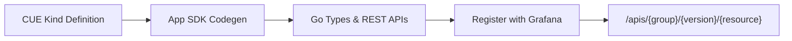
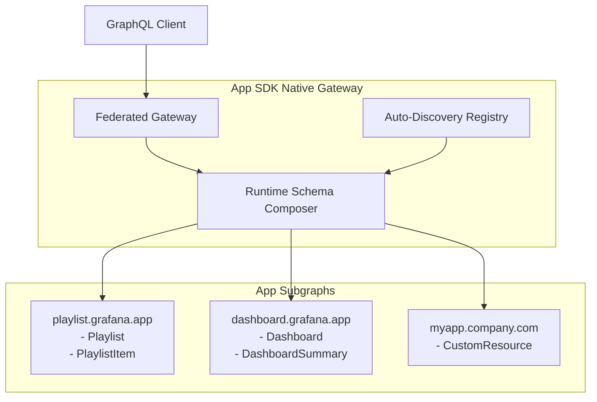

# GraphQL Federation Architecture for Grafana App Platform

## Overview

This document outlines the design for a federated GraphQL API architecture that leverages the Grafana App Platform's existing patterns. Instead of a centralized GraphQL service, each App Platform app contributes its own GraphQL subgraph, which are then composed into a unified API.

## Background: App Platform & CUE Concepts

### What is the App Platform?

The Grafana App Platform allows developers to create applications that extend Grafana with custom resource types (called "kinds"). These apps follow Kubernetes-style APIs and can be deployed alongside Grafana core.

### CUE (Configure, Unify, Execute)

CUE is a data validation and configuration language used in the App Platform to define resource schemas:

```cue
// Example: Playlist kind definition
#PlaylistKind: {
    kind: "Playlist"
    apiVersion: "playlist.grafana.app/v0alpha1"

    spec: #PlaylistSpec
}

#PlaylistSpec: {
    title: string
    description?: string
    items: [...#PlaylistItem]
    interval: string | *"5m"
}

#PlaylistItem: {
    type: "dashboard_by_uid" | "dashboard_by_tag"
    value: string
    title?: string
}
```

**Key CUE Concepts:**

- **Schemas**: Define the structure and validation rules for data
- **Types**: Reusable schema definitions (prefixed with `#`)
- **Constraints**: Built-in validation (required fields, types, defaults)
- **Composition**: Schemas can embed and extend other schemas

### Current App Platform Flow



## Federated GraphQL Architecture

### Core Concept

Instead of one centralized GraphQL service, each app provides its own GraphQL subgraph. The App SDK's native gateway composes these subgraphs into a unified API using runtime schema composition.



### Architecture Principles

**Native Go Implementation**: Built directly into the App SDK without external dependencies, ensuring consistency with App Platform patterns and avoiding operational complexity.

**Runtime Composition**: Schemas are composed at startup and can be refreshed as apps are registered/unregistered, providing flexibility without the overhead of request-time composition.

**Storage Delegation**: GraphQL resolvers delegate to existing REST storage implementations, eliminating the need for data migration while reusing battle-tested storage logic.

### Schema Generation Strategy

#### Automatic Generation from CUE

The App SDK will automatically generate GraphQL schemas from existing CUE kind definitions:

**CUE Definition:**

```cue
#PlaylistKind: {
    kind: "Playlist"
    spec: {
        title: string
        description?: string
        items: [...#PlaylistItem]
    }
}
```

**Generated GraphQL Schema:**

```graphql
type Playlist {
  apiVersion: String!
  kind: String!
  metadata: ObjectMeta!
  spec: PlaylistSpec!
}

type PlaylistSpec {
  title: String!
  description: String
  items: [PlaylistItem!]!
}

type Query {
  playlist(namespace: String!, name: String!): Playlist
  playlists(namespace: String!): [Playlist!]!
}

type Mutation {
  createPlaylist(namespace: String!, input: PlaylistInput!): Playlist
  updatePlaylist(
    namespace: String!
    name: String!
    input: PlaylistInput!
  ): Playlist
  deletePlaylist(namespace: String!, name: String!): Boolean
}
```

#### Standard Patterns

Every CUE kind automatically gets:

1. **Object Types**: Generated from CUE spec structures
2. **Query Operations**:
   - `get{Kind}(namespace, name)` - Retrieve single resource
   - `list{Kind}s(namespace)` - List resources in namespace
3. **Mutation Operations**:
   - `create{Kind}(namespace, input)` - Create new resource
   - `update{Kind}(namespace, name, input)` - Update existing resource
   - `delete{Kind}(namespace, name)` - Delete resource
4. **Standard Fields**: All resources include `apiVersion`, `kind`, `metadata`

#### Type Mapping Rules

| CUE Type        | GraphQL Type       | Notes           |
| --------------- | ------------------ | --------------- |
| `string`        | `String`           |                 |
| `int`           | `Int`              |                 |
| `bool`          | `Boolean`          |                 |
| `[...T]`        | `[T]`              | Arrays          |
| `T?`            | `T` (nullable)     | Optional fields |
| `T \| *default` | `T` (with default) | Default values  |
| `#EmbeddedType` | `EmbeddedType`     | Type references |

### Relationship Handling

#### Defining Relationships in CUE

Relationships between kinds can be expressed through references:

```cue
#DashboardKind: {
    spec: {
        title: string
        // Reference to folder
        folderUID?: string @relation(kind: "Folder", field: "metadata.uid")
    }
}

#FolderKind: {
    spec: {
        title: string
    }
}
```

#### Generated Relationship Resolvers

The system will automatically generate resolvers for relationships:

```graphql
type Dashboard {
  spec: DashboardSpec!
}

type DashboardSpec {
  title: String!
  folderUID: String
  # Auto-generated relationship resolver
  folder: Folder @relation(field: "folderUID")
}

type Query {
  dashboard(namespace: String!, name: String!): Dashboard
  # Automatically supports relationship traversal:
  # query { dashboard { spec { folder { spec { title } } } } }
}
```

## Gateway Implementation

### Architecture Components

#### 1. Subgraph Interface

```go
// In App SDK graphql/subgraph package
type GraphQLSubgraph interface {
    GetSchema() *graphql.Schema
    GetGroupVersion() schema.GroupVersion
    GetKinds() []resource.Kind
    GetStorage(gvr schema.GroupVersionResource) Storage
}

// Extension interface for app providers
type GraphQLSubgraphProvider interface {
    GetGraphQLSubgraph() (GraphQLSubgraph, error)
}
```

#### 2. Native Schema Composition

```go
type FederatedGateway struct {
    subgraphs map[string]GraphQLSubgraph
    registry  *AppProviderRegistry
    schema    *graphql.Schema
}

func (g *FederatedGateway) ComposeSchema() (*graphql.Schema, error) {
    // Native Go schema composition
    // Merge fields from all subgraphs with namespace prefixing
    // Generate unified query/mutation types
    return g.buildUnifiedSchema()
}
```

#### 3. Auto-Discovery Integration

The gateway integrates with App Platform's registration pattern:

```go
// Auto-discovery finds GraphQL-capable providers
registry, err := gateway.AutoDiscovery(playlistProvider, dashboardProvider)
if err != nil {
    return nil, err
}

// Get composed gateway
federatedGateway := registry.GetFederatedGateway()

// Register GraphQL endpoint
http.HandleFunc("/graphql", federatedGateway.HandleGraphQL)
```

### Native Go Implementation Benefits

Our native implementation provides:

- **Zero External Dependencies**: Pure Go, no Node.js runtime required
- **App Platform Integration**: Seamless integration with existing patterns
- **Storage Delegation**: Reuses existing REST storage without data migration
- **Runtime Flexibility**: Compose schemas at startup, refresh as needed
- **Field Prefixing**: Automatic namespace resolution to avoid conflicts

## Implementation Status

### ✅ Phase 1: Foundation (Completed)

- **Auto-Generation**: GraphQL schemas generated from CUE kinds
- **Native Gateway**: Runtime schema composition implemented
- **Storage Integration**: Resolvers delegate to existing REST storage
- **Subgraph Interface**: Clean interface for apps to implement GraphQL

### ✅ Phase 2: App Platform Integration (Completed)

- **Real App Integration**: Playlist app successfully provides GraphQL subgraph
- **Auto-Discovery**: Gateway automatically finds GraphQL-capable providers
- **Storage Bridge**: Adapter pattern bridges GraphQL to existing REST storage
- **Zero Breaking Changes**: Existing apps unaffected, GraphQL is additive

### 🚧 Phase 3: Enhanced Features (Next)

- **Relationship Support**: `@relation` attributes in CUE for cross-kind relationships
- **Enhanced Type Mapping**: Beyond JSON scalars to proper CUE type conversion
- **Performance Optimization**: Query batching, caching, connection pooling
- **Security Features**: Field-level permissions, rate limiting, query complexity analysis

## Migration Strategy

### For App Developers

**Existing Apps (using "new way" pattern):**

1. Apps already using `AppProvider` get GraphQL automatically
2. No code changes required for basic CRUD
3. Opt-in to relationship definitions in CUE

**Custom Requirements:**

1. Apps can implement custom resolvers as needed
2. Extension points for complex business logic
3. Backward compatibility with existing REST APIs

### For Grafana Core

1. Create new branch without centralized GraphQL
2. Implement federated gateway alongside existing `/apis` endpoints
3. GraphQL becomes an additional interface to existing data
4. No changes to underlying storage or business logic

## Architectural Decision: Native Go Implementation

### Why Not External Tools?

We evaluated several external federation tools but chose to build natively:

**GraphQL Mesh (Rejected)**:

- Requires Node.js runtime (incompatible with Go-based App SDK)
- Would introduce significant operational complexity
- Doesn't understand CUE schema definitions
- Adds external dependencies and potential security concerns

**Bramble (Considered)**:

- Mature Go-based federation gateway
- Would require significant adaptation for App Platform patterns
- Lacks CUE integration and storage delegation
- Major rewrite effort with uncertain benefits

**Apollo Federation (Considered)**:

- Requires federation-specific SDL extensions
- Designed for services you control, not auto-generation
- Doesn't solve the problem of generating from CUE kinds

### Benefits of Native Implementation

- **Perfect Integration**: Built specifically for App Platform patterns
- **Zero Dependencies**: No external runtimes or services to manage
- **CUE-First**: Designed around CUE schema definitions
- **Storage Delegation**: Reuses existing, battle-tested storage layers
- **Incremental Enhancement**: Can evolve exactly as needed

## Benefits

### For App Developers

- **Zero GraphQL Knowledge Required**: Automatic generation from familiar CUE
- **One Interface Method**: Implement `GetGraphQLSubgraph()` to get GraphQL support
- **Storage Reuse**: Existing REST storage implementations work unchanged
- **Consistent Patterns**: Follows existing App Platform conventions

### For API Consumers

- **Single Endpoint**: One GraphQL endpoint for all app data
- **Efficient Queries**: Request exactly the data needed
- **Type Safety**: Generated types and schema validation
- **Field Prefixing**: Clear namespacing prevents conflicts (e.g., `playlist_playlist`)

### For Platform

- **Decentralized**: Each app owns its GraphQL schema
- **Scalable**: Apps can be developed and deployed independently
- **Maintainable**: Auto-generation reduces manual schema maintenance
- **Extensible**: Easy to add new apps and capabilities
- **Operational Simplicity**: Pure Go, no additional runtimes required

## Example Usage

```graphql
# Query playlist with related dashboard information
query GetPlaylistWithDashboards($namespace: String!, $name: String!) {
  playlist(namespace: $namespace, name: $name) {
    metadata {
      name
      namespace
      creationTimestamp
    }
    spec {
      title
      description
      items {
        type
        value
        title
        # If items reference dashboards, auto-resolved relationship
        dashboard {
          spec {
            title
            description
          }
        }
      }
    }
  }
}
```

This architecture provides a powerful, flexible GraphQL API that grows naturally with the App Platform ecosystem while maintaining the simplicity and conventions that developers already know.
