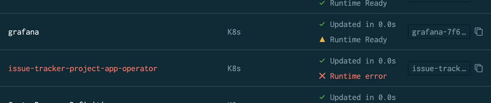
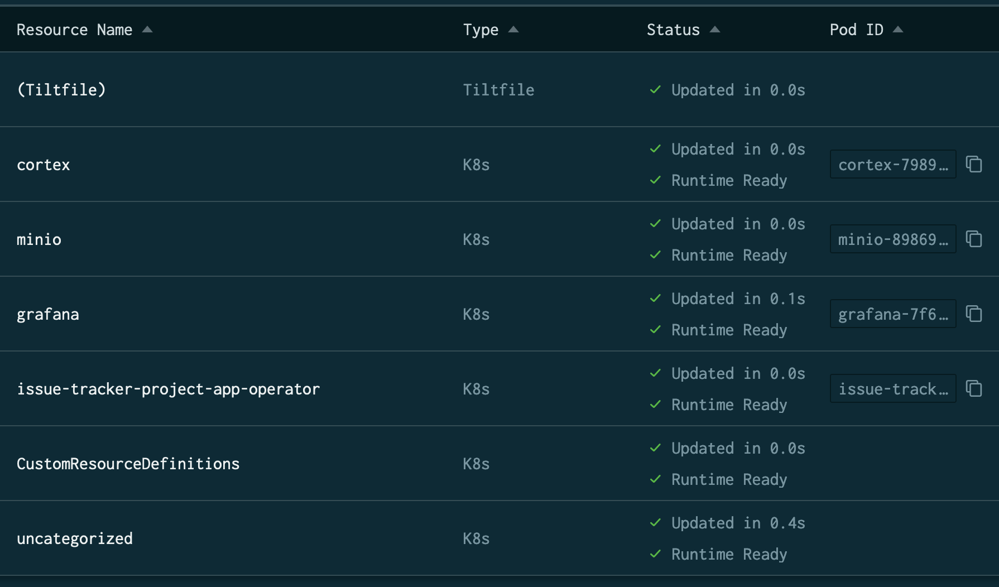

# Local Deployment

At this point, with our generated code and our boilerplate, we have a functioning application which we can build and deploy locally. 
It doesn't yet have a UI, but we can still go through the process of standing up our local environment and proving out that our schemas are right 
and our APIs function, so let's do that.

## Building Everything

First of all, we need to build our project. Luckily, the Makefile created by our `grafana-app-sdk project init` has us covered. All we need to do is run a `make build`.
```shell
$ make build
Error parsing magefiles: error running "go list -f {{.Dir}}||{{.Name}} github.com/grafana/grafana-plugin-sdk-go/build": exit status 1
no required module provides package github.com/grafana/grafana-plugin-sdk-go/build; to add it:
	go get github.com/grafana/grafana-plugin-sdk-go/build
make: *** [build/plugin-backend] Error 1
```

Hang on, something isn't right. Well, we generated code, and build out boilerplate, but go doesn't know about any of the libraries our boilerplate and generated code need to import. You could run `go get` for all the go files, but our Makefile, again, has us covered:
```shell
make deps
```
This will `go get` all the go modules we use, and then vendor them in the `vendor` directory.

Now we can run our build successfully:
```shell
make build
```
We get _a lot_ of output for this command:
```shell
$ make build
Running dependency: github.com/grafana/grafana-plugin-sdk-go/build.Build.GenerateManifestFile-fm
Running dependency: github.com/grafana/grafana-plugin-sdk-go/build.Build.Windows-fm
Running dependency: github.com/grafana/grafana-plugin-sdk-go/build.Build.Darwin-fm
Running dependency: github.com/grafana/grafana-plugin-sdk-go/build.Build.LinuxARM-fm
Running dependency: github.com/grafana/grafana-plugin-sdk-go/build.Build.LinuxARM64-fm
Running dependency: github.com/grafana/grafana-plugin-sdk-go/build.Build.Linux-fm
Running dependency: github.com/grafana/grafana-plugin-sdk-go/build.Build.DarwinARM64-fm
exec: go "build" "-o" "dist/gpx_issue-tracker-project-app_darwin_amd64" "-ldflags" "-w -s -extldflags \"-static\" -X 'github.com/grafana/grafana-plugin-sdk-go/build.buildInfoJSON={\"time\":1680111821582,\"version\":\"1.0.0\"}' -X 'main.version=1.0.0'" "./pkg"
exec: go "build" "-o" "dist/gpx_issue-tracker-project-app_linux_arm" "-ldflags" "-w -s -extldflags \"-static\" -X 'main.version=1.0.0' -X 'github.com/grafana/grafana-plugin-sdk-go/build.buildInfoJSON={\"time\":1680111821582,\"version\":\"1.0.0\"}'" "./pkg"
exec: go "build" "-o" "dist/gpx_issue-tracker-project-app_windows_amd64.exe" "-ldflags" "-w -s -extldflags \"-static\" -X 'main.version=1.0.0' -X 'github.com/grafana/grafana-plugin-sdk-go/build.buildInfoJSON={\"time\":1680111821581,\"version\":\"1.0.0\"}'" "./pkg"
exec: go "build" "-o" "dist/gpx_issue-tracker-project-app_linux_arm64" "-ldflags" "-w -s -extldflags \"-static\" -X 'github.com/grafana/grafana-plugin-sdk-go/build.buildInfoJSON={\"time\":1680111821581,\"version\":\"1.0.0\"}' -X 'main.version=1.0.0'" "./pkg"
exec: go "build" "-o" "dist/gpx_issue-tracker-project-app_darwin_arm64" "-ldflags" "-w -s -extldflags \"-static\" -X 'main.version=1.0.0' -X 'github.com/grafana/grafana-plugin-sdk-go/build.buildInfoJSON={\"time\":1680111821582,\"version\":\"1.0.0\"}'" "./pkg"
exec: go "build" "-o" "dist/gpx_issue-tracker-project-app_linux_amd64" "-ldflags" "-w -s -extldflags \"-static\" -X 'main.version=1.0.0' -X 'github.com/grafana/grafana-plugin-sdk-go/build.buildInfoJSON={\"time\":1680111821581,\"version\":\"1.0.0\"}'" "./pkg"
yarn install v1.22.19
info No lockfile found.
[1/5] 🔍  Validating package.json...
[2/5] 🔍  Resolving packages...
[3/5] 🚚  Fetching packages...
[4/5] 🔗  Linking dependencies...
[5/5] 🔨  Building fresh packages...
success Saved lockfile.
✨  Done in 43.63s.
yarn run v1.22.19
$ grafana-toolkit plugin:build
  Using Node.js v16.19.1
  Using @grafana/toolkit v9.4.7
✔ Linting
No tests found, exiting with code 0
✔ Running tests
⠦ Compiling...
   asset module.js 3.27 KiB [emitted] [minimized] (name: module) 1 related asset
  asset plugin.json 939 bytes [emitted] [from: plugin.json] [copied]
  asset README.md 14 bytes [emitted] [from: ../README.md] [copied]
  orphan modules 6.24 KiB [orphan] 8 modules
  runtime modules 937 bytes 4 modules
  built modules 6.57 KiB [built]
    modules by path external "@grafana/ 84 bytes
      external "@grafana/data" 42 bytes [built] [code generated]
      external "@grafana/ui" 42 bytes [built] [code generated]
    ./module.ts + 8 modules 6.37 KiB [built] [code generated]
    external "react" 42 bytes [built] [code generated]
    external "react-router-dom" 42 bytes [built] [code generated]
    external "@emotion/css" 42 bytes [built] [code generated]
  webpack 5.77.0 compiled successfully in 1395 ms

✔ Compiling...
✨  Done in 3.99s.
docker build -t "issue-tracker-project" -f cmd/operator/Dockerfile .
[1/2] STEP 1/8: FROM golang:1.20-alpine AS builder
[1/2] STEP 2/8: WORKDIR /build
--> Using cache 161e1c4eb874059c9f3a093e3188598f973f94f9e9c9aeaa25e787c758bc6aff
--> Pushing cache []:841f2bd8f3176507e331f8ecc6b699b12b8890db273f886646c13506d94ec50e
--> 161e1c4eb87
[1/2] STEP 3/8: COPY go.mod go.sum ./
--> Pushing cache []:9208e0af95e7fae1c456cbf85b88f6cbbffa6e128b9324f1fea96c6f5a47d3d8
--> 840dc9305b7
[1/2] STEP 4/8: COPY vendor* ./vendor
--> Pushing cache []:9f2d55bdbdcd1055db0a1e0ff0d29b01469ca088342f50ef5e611e2ea0814914
--> 858195e1513
[1/2] STEP 5/8: RUN test -f vendor/modules.txt || go mod download
--> Pushing cache []:3351fe92e9ff989b7bb1cd6bc190b7c6c9ec71b2841606ecf75d1532346bd567
--> 4158b600bf1
[1/2] STEP 6/8: COPY cmd cmd
--> Pushing cache []:5884c3462b5be3b1c8e2c8d5c1b460fe33b78dc9b6c3503c163defb377f3f869
--> 0ce0468b569
[1/2] STEP 7/8: COPY pkg pkg
--> Pushing cache []:75aae1a2b8cce12c9798be2b3b878151e8f0f0f9644b15ffa4036b0e6dc91f40
--> 336bfbc2e91
[1/2] STEP 8/8: RUN go build -o "target/operator" cmd/operator/*.go
--> Pushing cache []:ceca0b35a0173f743104e73b59af00093af028b0dfc93c4ac24503556c117a0e
--> 4b186a95ef9
[2/2] STEP 1/3: FROM alpine AS runtime
[2/2] STEP 2/3: COPY --from=builder /build/target/operator /usr/bin/operator
--> Pushing cache []:b0d743ce105846b341f553335cab107c701f879cd1a27726a493e03003275b57
--> 46d20b4ccfd
[2/2] STEP 3/3: ENTRYPOINT ["/usr/bin/operator"]
[2/2] COMMIT issue-tracker-project
--> Pushing cache []:91ff3180d65dfd037224e369463671ef3f7e25c5646d8b2b110f810c90ea2bf0
--> 906636f6b28
Successfully tagged localhost/issue-tracker-project:latest
906636f6b282052709f2b541b325e33e588e2ce1e38d91117f79800216888352
```
(some parts of this trimmed for readability)

So what's with all the output? Well, `make build` is doing three separate things, just chained together.
1. Build the backend plugin binary (using `Magefile`)
2. Build the frontend plugin (using `yarn`)
3. Build the operator docker image (using `docker`)

If you only want to build one of those pieces at a time, there are default make targets for each:
1. `make build/plugin-backend`
2. `make build/plugin-frontend`
3. `make build/operator`

## Local Deployment

For our local deployment, we need to make sure we have a couple of prerequisites installed:
* docker (or podman with the docker socket listener)
* k3d
* tilt

Now, running our app locally is as simple as
```shell
$ make local/up
 * Writing file local/generated/k3d-config.json
 * Writing file local/generated/dev-bundle.yaml
INFO[0000] Using config file local/generated/k3d-config.json (k3d.io/v1alpha3#simple)
WARN[0000] Default config apiVersion is 'k3d.io/v1alpha4', but you're using 'k3d.io/v1alpha3': consider migrating.
INFO[0000] portmapping '9999:80' targets the loadbalancer: defaulting to [servers:*:proxy agents:*:proxy]
INFO[0000] Prep: Network
INFO[0000] Created network 'k3d-issue-tracker-project'
INFO[0000] Created image volume k3d-issue-tracker-project-images
INFO[0000] Starting new tools node...
INFO[0000] Starting Node 'k3d-issue-tracker-project-tools'
INFO[0001] Creating node 'k3d-issue-tracker-project-server-0'
INFO[0001] Creating LoadBalancer 'k3d-issue-tracker-project-serverlb'
INFO[0001] Using the k3d-tools node to gather environment information
INFO[0001] HostIP: using network gateway 10.89.0.1 address
INFO[0001] Starting cluster 'issue-tracker-project'
INFO[0001] Starting servers...
INFO[0001] Starting Node 'k3d-issue-tracker-project-server-0'
INFO[0005] All agents already running.
INFO[0005] Starting helpers...
INFO[0006] Starting Node 'k3d-issue-tracker-project-serverlb'
INFO[0012] Injecting records for hostAliases (incl. host.k3d.internal) and for 2 network members into CoreDNS configmap...
INFO[0014] Cluster 'issue-tracker-project' created successfully!
INFO[0014] You can now use it like this:
kubectl cluster-info
Tilt started on http://localhost:10350/
v0.31.2, built 2023-02-10

(space) to open the browser
(s) to stream logs (--stream=true)
(t) to open legacy terminal mode (--legacy=true)
(ctrl-c) to exit
```
Now, if I hit `space` and launch the tilt console, I can see the status of my local cluster's deployment. Everything looks alright, except for these two:


If we click on the `grafana` tile to see what the error is, it shows us the logs from the container, which end with:
```
logger=provisioning t=2023-03-29T18:16:41.17+0000 lvl=eror msg="Failed to provision plugins" error="app provisioning error: plugin not installed: \"issue-tracker-project-app\""
Failed to start grafana. error: app provisioning error: plugin not installed: "issue-tracker-project-app"
app provisioning error: plugin not installed: "issue-tracker-project-app"
```

So this is just something we didn't do before we started our environment. While we built the plugin, we want to also deploy it to our local cluster. The local cluster can only read from `local/mounted-files`, so we need it there. Simple enough fix, we run
```shell
$ make local/deploy_plugin 
tilt disable grafana
cp -R plugin/dist local/mounted-files/plugin/dist
tilt enable grafana
```
We can see that this stops the grafana deployment, copies our built plugin over into `local/mounted-files`, and then restarts the grafana deployment. 
We have to stop and restart, because if a plugin is already deployed and running, we can't overwrite the binary, as it's in-use by grafana. 
You can leave your local deployment running and make changes to your plugin this way, but just re-running a build and `make local/deploy_plugin`.

TODO: should this be part of the `make local/up` command?

OK, now grafana is all green on the dashboard, so let's take a look at the operator. 
If we click on the `issue-tracker-project` tile to learn more about the error, it shows us the event:
```
[event: pod issue-tracker-project-app-operator-c66c79cdc-65vvc] Failed to pull image "localhost/issue-tracker-project:latest": rpc error: code = NotFound desc = failed to pull and unpack image "localhost/issue-tracker-project:latest": failed to resolve reference "localhost/issue-tracker-project:latest": localhost/issue-tracker-project:latest: not found
```

k3d doesn't use the docker registry on your localhost, so we have to deploy it to the cluster. Luckily, that's very simple:
```shell
$ make local/push_operator 
# Tag the docker image as part of localhost, which is what the generated k8s uses to avoid confusion with the real operator image
INFO[0000] Importing image(s) into cluster 'issue-tracker-project' 
INFO[0000] Starting new tools node...                   
INFO[0000] Starting Node 'k3d-issue-tracker-project-tools' 
INFO[0000] Saving 1 image(s) from runtime...            
INFO[0001] Importing images into nodes...               
INFO[0001] Importing images from tarball '/k3d/images/k3d-issue-tracker-project-images-20230329142608.tar' into node 'k3d-issue-tracker-project-server-0'... 
INFO[0002] Removing the tarball(s) from image volume... 
INFO[0003] Removing k3d-tools node...                   
INFO[0003] Successfully imported image(s)               
INFO[0003] Successfully imported 1 image(s) into 1 cluster(s)
```

Now, if we take another look at our tilt console, everything looks great!


### Deploying Without Tilt

Though not recommended, you can deploy without using tilt, if you desire. Not using tilt removes the ability to easily extend your deployment with kubernetes yamls in `local/additional`, but you can remove the `tilt` commands in the Makefile, and simply use `kubectl` to apply `local/generated/dev-bundle.yaml`.

### Interacting With Our Local Deployment

Our grafana is now available at [grafana.k3d.localhost:9999](http://grafana.k3d.localhost:9999). 
Since our plugin is automatically installed, we can go to [grafana.k3d.localhost:9999/a/issue-tracker-project-app](http://grafana.k3d.localhost:9999/a/issue-tracker-project-app) and see the simple landing page that got generated for us, and we can interact with our backend APIs at [grafana.k3d.localhost:9999/api/plugins/issue-tracker-project-app/resources/v1/issues](http://grafana.k3d.localhost:9999/api/plugins/issue-tracker-project-app/resources/v1/issues).

Right now, if I do a curl to our list endpoint, we'll get back a response with an empty list:
```shell
$ curl http://grafana.k3d.localhost:9999/api/plugins/issue-tracker-project-app/resources/v1/issues | jq .
{
  "kind": "IssueList",
  "apiVersion": "issuetrackerproject.ext.grafana.com/v1",
  "metadata": {
    "resourceVersion": "1159"
  },
  "items": []
}
```

Our kinds are also available via the grafana API server, located at [http://grafana.k3d.localhost:9999/apis]. This is a kubernetes-compatible API server, and we can interact with it via cURL, or kubectl. 
Let's also list our issues that way:
```shell
curl http://grafana.k3d.localhost:9999/apis/issuetrackerproject.ext.grafana.com/v1/namespaces/default/issues
{
  "apiVersion": "issuetrackerproject.ext.grafana.com/v1",
  "items": [],
  "kind": "IssueList",
  "metadata": {
    "continue": "",
    "resourceVersion": "1159"
  }
}
```
We can see the output is nearly identical, as the plugin backend is just a proxy to the API server. From this point, we could use the plugin backend or API server API, 
but seeing as the plugin backend will eventually be phased out of the default path, let's use the API server here, and create an Issue:
```shell
$ curl -X POST -H "content-type:application/json" -d '{"kind":"Issue","apiVersion":"issuetrackerproject.ext.grafana.com/v1","metadata":{"name":"test-issue","namespace":"default"},"spec":{"title":"Test","description":"A test issue","status":"open"}}' http://grafana.k3d.localhost:9999/apis/issuetrackerproject.ext.grafana.com/v1/namespaces/default/issues
{
  "apiVersion": "issuetrackerproject.ext.grafana.com/v1",
  "kind": "Issue",
  "metadata": {
    "creationTimestamp": "2024-12-04T23:44:22Z",
    "generation": 1,
    "managedFields": [
      {
        "apiVersion": "issuetrackerproject.ext.grafana.com/v1",
        "fieldsType": "FieldsV1",
        "fieldsV1": {
          "f:spec": {
            ".": {},
            "f:description": {},
            "f:status": {},
            "f:title": {}
          }
        },
        "manager": "curl",
        "operation": "Update",
        "time": "2024-12-04T23:44:22Z"
      }
    ],
    "name": "test-issue",
    "namespace": "default",
    "resourceVersion": "1408",
    "uid": "c3c7c651-324f-41f0-8ddd-85daa25195d8"
  },
  "spec": {
    "description": "A test issue",
    "status": "open",
    "title": "Test"
  }
}
```
Now if we list issues again, we'll see the issue we just made in the output.

You can see that this includes metadata which we didn't define in our CUE, but was implicitly added (kubernetes metadata). 

For fun, we can also interact with our resources through kubectl:
```shell
$ kubectl get issue test-issue -o yaml
apiVersion: issuetrackerproject.ext.grafana.com/v1
kind: Issue
metadata:
  creationTimestamp: "2024-12-04T23:44:22Z"
  finalizers:
  - issue-tracker-project-issues-finalizer
  generation: 1
  name: test-issue
  namespace: default
  resourceVersion: "1409"
  uid: c3c7c651-324f-41f0-8ddd-85daa25195d8
spec:
  description: A test issue
  status: open
  title: Test
```
Here we can note that the non-kubernetes metadata which is part of common metadata is encapsulated in `metadata.annotations` when stored in kubernetes. 
The SDK does a transform between our go/CUE representation of the object and the implementation-specific storage representation of the object.

In future versions of the SDK, pre-built mutating webhooks for kubernetes will be available to automatically deal with the common metadata on admission, 
with the option to extend them for custom metadata.

We can also see that the operator is monitoring adds/updates/deletes to our issues if we take a look at its logs, either through the Tilt console, or via kubectl:
```
{"time":"2024-12-04T23:44:22.388481222Z","level":"DEBUG","msg":"Added resource","name":"test-issue","traceID":"cfffb1cf88e0370ad48a185b3a321881"}
```

If we delete the issue, we'll also see that delete show up in our operator:
```shell
kubectl delete issue test-issue
```
Now the operator logs show:
```
{"time":"2024-12-04T23:44:22.388481222Z","level":"DEBUG","msg":"Added resource","name":"test-issue","traceID":"cfffb1cf88e0370ad48a185b3a321881"}
{"time":"2024-12-04T23:46:47.696342678Z","level":"DEBUG","msg":"Deleted resource","name":"test-issue","traceID":"cf4bfc9b933da55ef6cea6187689f814"}
```
(plus some other logging)

Alright! We have a local test environment that we can keep up and running if we like for the rest of the tutorial, or we can stop it. To take down the deployed resources from the cluster, you can use `make local/down`. To delete the cluster entirely, you can use `make local/clean`. For the rest of this tutorial, we're going to assume the local environment is still up and running. Now, it's time to actually write some code, [starting with fleshing out our plugin's front-end](06-frontend.md).

### Prev: [Generating Boilerplate](04-boilerplate.md)
### Next: [Writing Our Front-End](06-frontend.md)
