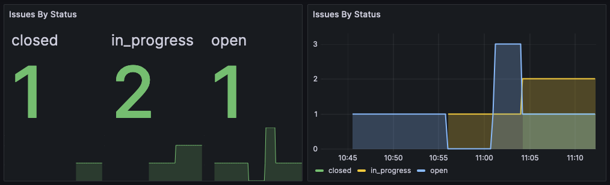

# Writing Operator Code

We actually already have some simple operator code generated for us by our `project add` command earlier, so instead of writing new code, let's just talk a bit about what the operator does, and ways of running it.

By default, the operator is run as a separate container alongside your grafana deployment. For simple cases in which only one Grafana instance is running, the operator can be embedded in your plugin. However, this approach has several caveats — most notably, it can’t start until you navigate to your plugin’s page in Grafana. For this reason, the operator is ordinarily deployed as a separate service.

The operator is a logical pattern that runs one or more controllers. The typical use-case for a controller is the `operator.InformerController`, which holds:
* One or more informers, which subscribe to events for a particular resource kind and namespace
* One or more watchers, which consume events for particular kinds

Your app can be run as a standalone operator by making use of the `operator.Runner`. This takes the functionality exposed by your app, and runs it as a standard kubernetes operator, 
including exposing webhooks for the kubernetes API server to hook into. Other means of running the app (runners) will be introduced at a later date.

In our case, the boilerplate code uses the `simple.App` to build our app, and the `operator.Runner` as the runner. 
Since the runner only exposes behavior from the app in an expected way for the runner type, the watcher for our `Issue` type is where we build the App, 
in `pkg/app/app.go`:
```golang
func New(cfg app.Config) (app.App, error) {
    issueWatcher, err := watchers.NewIssueWatcher()
	if err != nil {
		return nil, fmt.Errorf("unable to create IssueWatcher: %w", err)
    }

    config := simple.AppConfig{
        // Trimmed
        ManagedKinds: []simple.AppManagedKind{
        {
            Kind:    issuev1alpha1.Kind(),
            Watcher: issueWatcher,
        },
    },
}
```
This code creates a watcher for receiving events, and then has the `simple.App` attach it to its own internal controller for the kind. 
If we wanted to introduce filtering (for example, only watch  a specific namespace, or label value), we could add `ReconcileOptions` to the `AppManagedKind`.

Since the way we make our Issue watcher is by calling `watchers.NewIssueWatcher()`, let's take a look at the `watchers` package (which was added by our `project add operator` command), and open `pkg/watchers/watcher_issue.go`:
```go
var _ operator.ResourceWatcher = &IssueWatcher{}

type IssueWatcher struct{}

func NewIssueWatcher() (*IssueWatcher, error) {
	return &IssueWatcher{}, nil
}
```
So we have `IssueWatcher`, which implements `operator.ResourceWatcher`. The `Add`, `Update`, `Delete`, and `Sync` functions are all relatively self-explanatory, but let's examine the `Add` one just to be on the same page:
```go
// Add handles add events for issuev1.Issue resources.
func (s *IssueWatcher) Add(ctx context.Context, rObj resource.Object) error {
	object, ok := rObj.(*issuev1alpha1.Issue)
	if !ok {
		return fmt.Errorf("provided object is not of type *issuev1alpha1.Issue (name=%s, namespace=%s, kind=%s)",
			rObj.StaticMetadata().Name, rObj.StaticMetadata().Namespace, rObj.StaticMetadata().Kind)
	}

	// TODO
	logging.FromContext(ctx).Debug("Added resource", "name", object.GetStaticMetadata().Identifier().Name)
	return nil
}
```
Each method does a check to see if the provided `resource.Object` is of type `*issuev1.Issue` (it always should be, provided we attached this watcher to the correct `resource.Kind`). We then just log a line declaring what resource was added, which we saw when [testing our local deployment](05-local-deployment.md).

So what else can we do in our watcher?

Well, right now, we could integrate with some third-party service, maybe you want to sync the issues created in you plugin with GitHub, or some internal issue-tracking tool. You may have some other task which should be performed when an issue is added, or updated, or deleted, which you should do in the operator. As more of grafana begins to use a kubernetes-like storage system, you could even create a resource of another kind in response to an add event, which some other operator would pick up and do something with. Why not do these things in the plugin backend?

Well, as we saw before, your plugin API isn't the only way to interact with Issues. You can create, update, or delete them via `kubectl`. But even if you restrict `kubectl` access, perhaps another plugin operator may want to create an Issue in response to one of _their_ events. If they did that via directly interfacing with the storage layer, you wouldn't notice that it happened. The operator ensures that no matter _how_ the mutation in the storage layer occurred (API, kubectl, other access), you are informed and can take action.

## Adding Behavior to Our Watcher

Let's add some simple behavior to our issue watcher to export metrics on issue counts by status. To do this, we'll want to export an additional metric from our operator, which we'll have to track in our watcher. Let's update our watcher code to add a `prometheus.GaugeVec` that we can use to track issue counts by status as a gauge (a gauge represents numbers which can increase or decrease, as opposed to a counter, which will only increase):
```go
import (
	// ...Existing imports omitted for brevity
	"github.com/prometheus/client_golang/prometheus"
)

type IssueWatcher struct {
	statsGauge *prometheus.GaugeVec
}

func NewIssueWatcher() (*IssueWatcher, error) {
	statsGauge := prometheus.NewGaugeVec(prometheus.GaugeOpts{
		Name:      "issues",
		Subsystem: "issue_watcher",
		Namespace: "issue_tracker_project",
		Help:      "Number of issues",
	}, []string{"status"})
	return &IssueWatcher{
		statsGauge: statsGauge,
	}, nil
}
```
The code in `NewIssueWatcher` now creates a new `GaugeVec` named `issue_tracker_project_issue_watcher_issues` with a `status` label, allowing us to track issue counts by status. All we need to do now is update the gauge with the correct label on our different watcher methods:
```go
// Add handles add events for issuev1alpha1.Issue resources.
func (s *IssueWatcher) Add(ctx context.Context, rObj resource.Object) error {
	ctx, span := otel.GetTracerProvider().Tracer("watcher").Start(ctx, "watcher-add")
	defer span.End()
	object, ok := rObj.(*issuev1alpha1.Issue)
	if !ok {
		return fmt.Errorf("provided object is not of type *issuev1alpha1.Issue (name=%s, namespace=%s, kind=%s)",
			rObj.GetStaticMetadata().Name, rObj.GetStaticMetadata().Namespace, rObj.GetStaticMetadata().Kind)
	}

	// Increase the gauge for the number of issues with the object's status
	s.statsGauge.WithLabelValues(object.Spec.Status).Inc()

	// TODO
	logging.FromContext(ctx).Debug("Added resource", "name", object.GetStaticMetadata().Identifier().Name)
	return nil
}

// Update handles update events for issuev1alpha1.Issue resources.
func (s *IssueWatcher) Update(ctx context.Context, rOld resource.Object, rNew resource.Object) error {
	ctx, span := otel.GetTracerProvider().Tracer("watcher").Start(ctx, "watcher-update")
	defer span.End()
	oldObject, ok := rOld.(*issuev1alpha1.Issue)
	if !ok {
		return fmt.Errorf("provided object is not of type *issuev1alpha1.Issue (name=%s, namespace=%s, kind=%s)",
			rOld.GetStaticMetadata().Name, rOld.GetStaticMetadata().Namespace, rOld.GetStaticMetadata().Kind)
	}

	newObject, ok := rNew.(*issuev1alpha1.Issue)
	if !ok {
		return fmt.Errorf("provided object is not of type *issuev1alpha1.Issue (name=%s, namespace=%s, kind=%s)",
			rNew.GetStaticMetadata().Name, rNew.GetStaticMetadata().Namespace, rNew.GetStaticMetadata().Kind)
	}

	// Update the gauge if the status changed
	if oldObject.Spec.Status != newObject.Spec.Status {
		s.statsGauge.WithLabelValues(oldObject.Spec.Status).Dec()
		s.statsGauge.WithLabelValues(newObject.Spec.Status).Inc()
	}

	// TODO
	logging.FromContext(ctx).Debug("Updated resource", "name", oldObject.GetStaticMetadata().Identifier().Name)
	return nil
}

// Delete handles delete events for issuev1alpha1.Issue resources.
func (s *IssueWatcher) Delete(ctx context.Context, rObj resource.Object) error {
	ctx, span := otel.GetTracerProvider().Tracer("watcher").Start(ctx, "watcher-delete")
	defer span.End()
	object, ok := rObj.(*issuev1alpha1.Issue)
	if !ok {
		return fmt.Errorf("provided object is not of type *issuev1alpha1.Issue (name=%s, namespace=%s, kind=%s)",
			rObj.GetStaticMetadata().Name, rObj.GetStaticMetadata().Namespace, rObj.GetStaticMetadata().Kind)
	}

	// Decrease the number of issues with the status of the deleted object
	s.statsGauge.WithLabelValues(object.Spec.Status).Dec()

	// TODO
	logging.FromContext(ctx).Debug("Deleted resource", "name", object.GetStaticMetadata().Identifier().Name)
	return nil
}

// Sync is not a standard resource.Watcher function, but is used when wrapping this watcher in an operator.OpinionatedWatcher.
// It handles resources which MAY have been updated during an outage period where the watcher was not able to consume events.
func (s *IssueWatcher) Sync(ctx context.Context, rObj resource.Object) error {
	ctx, span := otel.GetTracerProvider().Tracer("watcher").Start(ctx, "watcher-sync")
	defer span.End()
	object, ok := rObj.(*issuev1alpha1.Issue)
	if !ok {
		return fmt.Errorf("provided object is not of type *issuev1alpha1.Issue (name=%s, namespace=%s, kind=%s)",
			rObj.GetStaticMetadata().Name, rObj.GetStaticMetadata().Namespace, rObj.GetStaticMetadata().Kind)
	}

	// Increase the gauge, since this method is called on startup for a resource which already exists,
	// but our gauge wouldn't have prior awareness of it.
	s.statsGauge.WithLabelValues(object.Spec.Status).Inc()

	// TODO
	logging.FromContext(ctx).Debug("Possible resource update", "name", object.GetStaticMetadata().Identifier().Name)
	return nil
}
```

If we were to build and deploy our new operator now, it wouldn't work quite right still. That's because the gauge we're tracking still needs to be exposed by the operator's prometheus scrape endpoint (that we have configured in our `simple.OperatorConfig`). To expose this, we'll need to be able to register the gauge from our watcher with the operator's registerer. This is just a matter of exposing our metric from the watcher, and registering it with the operator. The different grafana-app-sdk types which export metrics expose their prometheus collectors by implementing the interface `metrics.Provider`, which is defined as
```go
type Provider interface {
	PrometheusCollectors() []prometheus.Collector
}
```
So, to conform with the best practices of the app-sdk, let's also implement this interface in our watcher by adding that method:
```go
func (s *IssueWatcher) PrometheusCollectors() []prometheus.Collector {
	return []prometheus.Collector{s.statsGauge}
}
```
Easy! Now that we’ve implemented the interface, the app will automatically pick up the metrics.

The operator runner then exposes the app's metrics via a `/metrics` endpoint, which the local setup automatically scrapes. 
So if we re-build and re-deploy our operator, we'll start picking up that new metric in our local grafana.
```shell
make build/operator && make local/push_operator
```
Then restart the operator in your tilt console and hop on over to [grafana.k3d.localhost:9999](http://grafana.k3d.localhost:9999) to find the metric. [This link](http://grafana.k3d.localhost:9999/explore?orgId=1&left=%7B%22datasource%22:%22grafana-prom-cortex%22,%22queries%22:%5B%7B%22refId%22:%22A%22,%22expr%22:%22issue_tracker_project_issue_watcher_issues%22,%22range%22:true,%22instant%22:true,%22datasource%22:%7B%22type%22:%22prometheus%22,%22uid%22:%22grafana-prom-cortex%22%7D,%22editorMode%22:%22builder%22%7D%5D,%22range%22:%7B%22from%22:%22now-15m%22,%22to%22:%22now%22%7D%7D) will bring you right to the Explore page for the metric, but feel free to play around with it yourself to get used to it, or build out a dashboard.



There's an example dashboard using the issue metrics [here](./issue-dashboard.json), which you can import via the grafana UI.

## Using the `status` Subresource

Good practice for an operator is that we use the `status` subresource to track operator processing. In our case, with only metrics, we don't need `status` for much, but if we were to do something else, such as create a resource in another system (or even within the API server), we would want a means to track it. Sometimes, it can also be useful for debugging our operator to simply just track the last time the operator processed an object (and how that turned out). The default `status` type for any generated resource has an operator- and kind-agnostic way of tracking this via `operatorStates`, but we can also customize our `status` subresource for our operator's behavior, since we're the kind author (`operatorStates` allows non-kind-authors who work with your kinds (and have permission to do so) to log their status information). Let's update our kind CUE to include some custom `status` information. All we really care about right now is knowing _when_ we last processed, so we'll add a field to track that.
```shell
curl -o kinds/issue.cue https://raw.githubusercontent.com/grafana/grafana-app-sdk/main/docs/tutorials/issue-tracker/cue/issue-v2.cue
```
Here we update the kind v1alpha1 `schema` to include 
```cue
status: {
	processedTimestamp: string & time.Time
}
```
Since we're using a `time.Time` type, we also have to import `"time"` at the top of our file (and use `string & time.Time` for codegen-specific reasons, see [Writing Kinds: Complex Schemas](../../custom-kinds/writing-kinds.md#complex-schemas)).

After updating our CUE, we need to re-run the codegen
```shell
make generate
```

Now we can have our watcher update the new status field in all of its handling methods. But how do we do this? The easiest way is to use a [Store](../../resource-stores.md), to be able to make changes to the object like interacting with a Key-Value store (we could also use a `resource.Client` and issue a PATCH request, but that's a bit more complex and is left as an exercise if you'd like to take that approach).

### Using TypedStore

Alright, let's put a store in our watcher:
```go
type IssueWatcher struct {
	statsGauge *prometheus.GaugeVec
	issueStore *resource.TypedStore[*issuev1alpha1.Issue]
}

func NewIssueWatcher(clientGenerator resource.ClientGenerator) (*IssueWatcher, error) {
	statsGauge := prometheus.NewGaugeVec(prometheus.GaugeOpts{
		Name:      "issues",
		Subsystem: "issue_watcher",
		Namespace: "issue_tracker_project",
		Help:      "Number of issues",
	}, []string{"status"})
	issueStore, err := resource.NewTypedStore[*issuev1alpha1.Issue](issuev1alpha1.Kind(), clientGenerator)
	if err != nil {
		return nil, fmt.Errorf("error creating issue TypedStore: %w", err)
	}
	return &IssueWatcher{
		statsGauge: statsGauge,
		issueStore: issueStore,
	}, nil
}
```
What is `resource.TypedStore`? It's a type which will let us interact with our `issuev1.Issue` objects directly as if they were stored in a key/value storage system. It is an abstraction over the `resource.Client` which interacts directly with the API server. The capability it has here that we're interested in is the `UpdateSubresource` function, which will, as the name suggests, allow us to update a subresource.

> [!IMPORTANT]
> Note that updating the resource inside a watcher or reconciler event will trigger _another_ event based on the update. Updating a subresource (such as `status`) will not update the resource's `Generation` value, so if you use the opinionated logic (which `simple.Operator` wraps your watchers and reconcilers in) these events won't propagate to your watchers/reconcilers. If you don't use the opinionated logic, you'll need to be aware of and handle these subresource updates properly in your business logic.

Let's update our `Add` and `Update` methods in our watcher, adding the following code _before_ our gauge code in `Add`:
```go
object.Status.ProcessedTimestamp = time.Now()
if _, err := s.issueStore.UpdateSubresource(ctx, object.GetStaticMetadata().Identifier(), resource.SubresourceStatus, object); err != nil {
	return err
}
```
and in `Update`:
```go
newObject.Status.ProcessedTimestamp = time.Now()
if _, err := s.issueStore.UpdateSubresource(ctx, newObject.GetStaticMetadata().Identifier(), resource.SubresourceStatus, newObject); err != nil {
	return err
}
```
and in `Sync`:
```go
object.Status.ProcessedTimestamp = time.Now()
if _, err := s.issueStore.UpdateSubresource(ctx, object.GetStaticMetadata().Identifier(), resource.SubresourceStatus, object); err != nil {
	return err
}
```
Now that our watcher methods are performing an action that can result in an error, we want to return said error if it occurs, so that the action can be retried. We want to do this _before_ our gauge code, because if we return an error and retry, we don't want to increase the gauge again. We also want this timestamp to reflect the last time we updated the gauge.

We can't re-build our operator yet, because now our `NewIssueWatcher` function requires an argument: a `resource.ClientGenerator`. A `ClientGenerator` is an object which can return `resource.Client` implementations for a provided kind. We can generate one from scratch for `k8s.Client` with `k8s.NewClientRegistry`, using a kubernetes config, such as the one provided by the app config:
```go
issueWatcher, err := watchers.NewIssueWatcher()
```
to this:
```go
issueWatcher, err := watchers.NewIssueWatcher(k8s.NewClientRegistry(cfg.KubeConfig, k8s.DefaultClientConfig()))
```
Now, because we altered the schema of our kind, we'll need to re-deploy our local environment after re-building and pushing our operator:
```shell
make build/operator && make local/push_operator
```
```shell
make local/down && make local/up
```
Now, if you make a new issue, you'll see the `status.processedTimestamp` get updated.
```shell
echo '{"kind":"Issue","apiVersion":"issuetrackerproject.ext.grafana.com/v1alpha1","metadata":{"name":"test-issue","namespace":"default"},"spec":{"title":"Foo","description":"bar","status":"open"}}' | kubectl create -f -
```
```
% kubectl get issue test-issue -oyaml
apiVersion: issuetrackerproject.ext.grafana.com/v1alpha1
kind: Issue
metadata:
  creationTimestamp: "2025-07-10T16:21:45Z"
  finalizers:
  - issue-tracker-project-issues-finalizer
  generation: 1
  name: test-issue
  namespace: default
  resourceVersion: "2540"
  uid: c48fdd01-8c2a-45c1-8cd3-0b9b17d2a617
spec:
  description: bar
  status: open
  title: Foo
status:
  processedTimestamp: "2025-07-10T16:21:45.473248501Z"
```
Now whenever the watcher processes an Add, Update, or Sync, it'll update the `processedTimestamp`.

Tracking data in the `status` subresource is an operator best practice. For other considerations when writing an operator, check out [Considerations When Writing a Reconciler](../../writing-a-reconciler.md#considerations-when-writing-a-reconciler).

Now that we have a watcher that does something, let's look at adding some other capabilities to our app: [API admission control](08-adding-admission-control.md).

### Prev: [Writing Our Front-End](06-frontend.md)
### Next: [Adding Admission Control](08-adding-admission-control.md)
